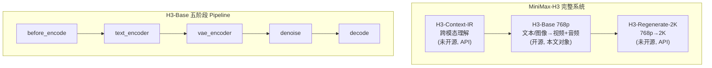
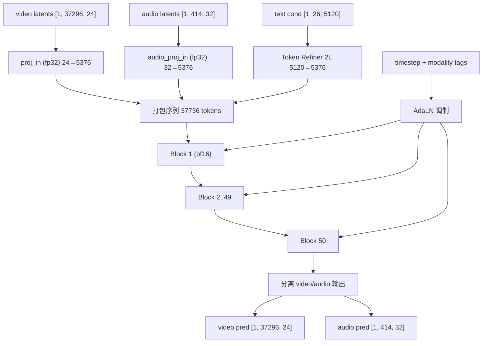
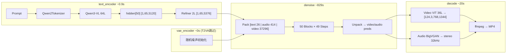

# MiniMax-H3 视频生成推理：从架构原理到加速实践

> **TL;DR** 全部正式实验均为单卡 A100-80GB、T2VA、1344×768、124 帧、24 fps、seed 0。标准 diffusers 与 SGLang 使用 50 个 sigma 点（49 次 DiT 前向）；diffusers Turbo LoRA 使用 9 个 sigma 点（8 次前向），单独比较。diffusers 最快 50-sigma 单视频为 SageAttention + FBCache 0.25：569.5 s；Sage + Turbo LoRA 为 557.7 s，但采样口径和质量特性不同。SGLang 全部 52 个 block 常驻 HBM 后，50-sigma raw 从 5147.7 s 降至 1148.8 s 且输出无损；默认 FA3 + Cache-DiT 0.24（MC3）为 651.5 s；服务级切换 SageAttention 并把 Cache-DiT 放宽到阈值 0.32、连续命中上限 MC9 后为 574.5 s，与 diffusers Sage + FBCache 0.25 基本持平（+0.9%）。所有缓存路径均有损。

## 0. 阅读指南

### 数据分类

本文所有数字严格标注来源类别：

| 标记 | 含义 | 验证方式 |
|---|---|---|
| **实测** | 本机跑出，附 run ID | 主线：`runs/<id>/run.json`；诊断/失败/旧口径：`runs/bak/<id>/run.json` |
| **官方声称** | MiniMax / SGLang 文档原文 | 附文档行号或 URL |
| **推导** | 由实测数据计算 | 附计算过程 |

### 研究范围：仅 T2VA

H3-Base 支持 T2VA / FL2VA / Ref2VA 三种任务模式（§1），但**本文 Part II 的全部正式加速实验都只在 T2VA 模式下测得**，输出统一为 1344×768、124 帧、24 fps。标准 diffusers 与 SGLang 使用 50 个 sigma 点（49 次 DiT 前向）；Turbo LoRA 使用 9 个 sigma 点（8 次前向）。另外两种模式的状态如下：

| 模式 | 做过什么 | 未做什么 |
|---|---|---|
| T2VA | 本文全部实验 | — |
| FL2VA | 1 次无加速功能性验证（run `diffusers_fl2va-20260920-234316`，已移入 `runs/bak/`；denoise 977.1 s，step 中位数 20092 ms，比 T2VA 的 ~17000 ms 高约 18%） | 任何加速手段的耗时/质量验证 |
| Ref2VA | 仅源码分析：denoise 使用的 transformer 与 T2VA 配置相同，注意力无 mask，推断没有 T2VA 之外的新加速杠杆 | 任何运行 |

因此文中的加速比和质量结论**不能直接外推到 FL2VA / Ref2VA**：它们的打包序列更长（含条件帧/参考前缀），FBCache 命中率、SageAttention 收益和显存余量都可能不同，需单独实测。

### 适用场景与前置知识

本文面向熟悉深度学习基础（Transformer、VAE、扩散模型概念）但不一定了解视频扩散模型的工程师。读者需要理解 PyTorch 推理流程、GPU 显存管理、BF16 混合精度的基本概念。

### 实验环境摘要

本文只采用当前统一环境的结果；早期其他软件栈下的数字不再进入性能表，也不用于推导。正式实验使用相同硬件、软件、分辨率、帧数、prompt 和 seed；采样步数分为标准 50-sigma 与 Turbo 9-sigma 两种口径，表格中必须显式标注。

| 项 | 统一环境 | 来源 |
|---|---|---|
| GPU / HBM | NVIDIA A100-SXM4-80GB，CC 8.0，79.32 GiB，108 SM | 实测 |
| 主机内存 | 122.8 GiB（page cache 上限约 112 GiB） | 实测 |
| PyTorch / CUDA / cuDNN | 2.13.0+cu130 / 13.0 / 9.20.00 | 实测 |
| diffusers / Triton | 0.40.0 / 3.7.1 | 实测 |
| Attention 后端 | torch SDPA；SageAttention 2.2.0 | 实测 |
| TF32 matmul | 禁用（precision=highest） | 实测 |

> 完整环境指纹记录在每个 `runs/<id>/run.json` 的 `env` 段。报告中的主线 run 均已核对为这套环境。

### Run 命名规则

每个 run 的 ID 同时用于 `runs/<id>/`、`outputs/<id>/`、`logs/<id>.log`，格式为 `<方法>-<YYYYMMDD>-<HHMMSS>`。diffusers 由 `scripts/run_naming.py`、SGLang 由 `scripts/run_sglang_h3.py` 自动生成。<方法> 按以下固定顺序拼接，未启用的段省略：

| 顺序 | 段 | 含义 | 例 |
|---:|---|---|---|
| 1 | 基本架构：`diffusers` / `turbolora` / `sglang` | diffusers 标准 50-sigma / diffusers + Turbo LoRA（9 个 sigma 点、8 次前向，§14）/ SGLang 50-sigma（§15） | `diffusers` |
| 2 | `batch<N>` | diffusers 阶段主序批处理 N 个不同 prompt（§13） | `batch20` |
| 3 | `sage` | SageAttention：diffusers 环境变量后端（§12）或 SGLang 服务级 DiT backend（§15.3） | `sage` |
| 4 | `fbcache<ttt>` / `cachedit<ttt>` | diffusers FBCache（§11）/ SGLang Cache-DiT（§15.4），阈值 ×100 补三位；两者机制不同（§9.4） | `fbcache025` = 0.25 |
| 5 | 其他 | `resident<L>`（SGLang DiT 常驻层数）、`mc<K>`（Cache-DiT 连续命中上限，缺省为默认 3）、`v4_8eval`（Turbo 配方）、`fl2va`、`compile`、`tf32`、`nodevmap`、`prefetch<P>`、`steps<S>`（步数不是 50）、`repeat<R>` / `reuse`（仅测量手段）、`probe` / `smoke`（短程探针） | `resident50_mc9` |

没有任何加速手段时为 `<架构>_raw`。例：`diffusers_batch20_sage_fbcache025-20260928-114735` = diffusers + 20 条不同 prompt 批处理 + Sage + FBCache 0.25；`sglang_sage_cachedit032_resident50_mc9-20261009-224947` = SGLang + Sage + Cache-DiT 0.32 + 52/52 block 常驻 + MC9。`--drop-page-cache`（冷启动）是测量条件而非方法，不进入名字，记录在 `run.json.page_cache.dropped`。早期手动编号（如 `-b1`、`-c1`、`-s1`）和旧段顺序（如 `sglang_resident50_cachedit024`、`sage_turbolora_*`、无架构前缀的 diffusers 名）均已按此规则重命名；时间戳不变，历次旧 ID 依次保留在 `run.json.renamed_from` 列表中。`cmd.txt` 与 `run.log` 是原始凭证，其中的旧 `--tag`/路径不改写。

`runs/` 与 `outputs/` 根目录按两类框架保留可交付主线：diffusers（含标准 50-sigma 与 Turbo 9-sigma）和 SGLang（50-sigma）。旧环境、profile/加载标定、repeat/reuse 噪声测量、smoke、失败结果及短程探针均成对移入各自 `bak/`。归档只改变目录层级，不删除证据。

---

## Part I: 架构原理

## 1. 系统总览

MiniMax-H3 是一个端到端多模态视频生成系统，由三个功能模块组成（**官方声称**）：

- **H3-Context-IR**：上下文中间表示系统，解析文本/图像/音频/视频之间的跨模态关系，输出结构化表示。**未开源**，需调用 MiniMax Open Platform API。
- **H3-Base**：核心生成模型，接收文本 prompt（或 Context-IR 输出），通过扩散过程生成 768p 视频+音频。**已开源**，本文分析对象。
- **H3-Regenerate-2K**：2K 再生成模块，将 768p 结果以 in-context 方式回灌 H3 基模型恢复细节。**未开源**。

H3-Base 支持三种任务模式（**官方声称**）：T2VA（文本到视频）、FL2VA（首尾帧到视频）、Ref2VA（多模态参考到视频），通过 `ModularPipeline` 的 `workflow` 参数切换。



H3-Base 的 diffusers 实现为 `MiniMaxH3ModularPipeline` → `MiniMaxH3Blocks`，将推理拆分为五个顺序阶段（**实测**，源码 `scripts/run_h3.py:37-43` `STAGE_COMPONENTS`）。每个阶段只驻留必要组件，完成后释放显存，使峰值显存退化为最大单组件（~62 GiB transformer）而非全量 ~134 GiB。

## 2. 文本编码器

H3 使用 Qwen3-VL-32B 作为条件编码器（**实测**，`text_encoder/config.json` 声明 `Qwen3VLForConditionalGeneration`）。

| 参数 | 值 | 来源 |
|---|---|---|
| 架构 | Qwen3VLForConditionalGeneration | 实测, config.json |
| 层数 | 64 | 实测 |
| hidden_size | 5120 | 实测 |
| 注意力头数 | 64 (QA) + 8 (KV), GQA | 实测 |
| head_dim | 128 | 实测 |
| FFN intermediate | 25600 | 实测 |
| 位置编码 | M-RoPE, interleaved, sections [24,20,20] | 实测 |

编码流程：prompt 经 `Qwen2TokenizerFast` 分词后输入 Qwen3-VL，提取第 50 层（从 0 起计）的 `hidden_states` 作为条件向量。条件 token 数随 prompt 长度变化，本文基准狐狸 prompt 为 26 个（**实测**，profile trace 中 Token Refiner 注意力输入为 `[1, 26, 56, 128]`，run `diffusers_steps2-20260928-202235`）。

编码后经 **Token Refiner** 进一步精炼：2 层 transformer block，含 self-attention + SwiGLU FFN，无 AdaLN / RoPE（**实测**，`transformer/config.json` `num_refiner_layers: 2`）。Refiner 将 `text_dim=5120` 映射到 transformer 的 `hidden_size=5376`。

```
输入: prompt (str)
    ↓ Qwen2TokenizerFast
token_ids [1, 26]
    ↓ Qwen3-VL Layer 0-63, take hidden_states[50]
prompt_embeds [1, 26, 5120]
    ↓ context_embedder Linear(5120, 5376)
    ↓ Token Refiner (2 blocks, self-attn + SwiGLU)
text_cond [1, 26, 5376]
```

> **Text Encoder 最终输出**：`[1, 26, 5376]`（26 text tokens，projected to transformer hidden dim）

## 3. 视频与音频 VAE

### 3.1 视频 VAE：非对称设计

视频 VAE（`AutoencoderKLMiniMaxH3`）采用 **CNN 编码器 + ViT 解码器** 的非对称架构（**实测**，`vae/config.json`）：

| 参数 | 编码器 (CNN) | 解码器 (ViT) | 来源 |
|---|---|---|---|
| 架构 | 6 级下采样 ResNet | 36 block ViT | 实测 |
| block_out_channels | [128,256,256,512,512,1024] | dim 2048, 32 heads | 实测 |
| spatial 压缩 | 16× (因子 [2,2,2,2,1,1]) | — | 实测 |
| temporal 压缩 | 4× (因子 [1,2,2,1,1,1]) | — | 实测 |
| latent_channels | 24 | — | 实测 |

**17n+5 帧数约束推导**（**推导**，基于 config 实测值）：

VAE 使用因果时间分块（`clip_length=17`, `token_drop=3`）。每个 17 帧 chunk 经 4× 时间压缩后产生 `(17-1)/4 + 1 = 5` 个 latent 帧；尾部 chunk（5 帧）产生 `(5-1)/4 + 1 = 2` 个。总帧数 `17n+5` → latent 帧 `5n+2`。默认 `n=7` → **124 帧 → 37 latent 帧**。

空间维度：768/16 = 48, 1344/16 = 84，再经 patch_size `(1,2,2)` 后每 latent 帧含 `(48/2)×(84/2) = 24×42 = 1008` 个 patch。总视频 token 数 = **37 × 1008 = 37296**（**实测**验证，`hidden_states` 形状 `[1, 37296, 96]`）。

```
[1, 3, 124, 768, 1344] RGB 视频输入
    ↓ CNN encoder (6 级下采样: spatial 16×, temporal 4×)
[1, 24, 37, 48, 84] latent volume
    ↓ patchify (1, 2, 2)
[1, 37296, 96] video tokens (37×24×42 patches, 24×1×2×2 channels)
```

> **Video VAE 最终输出**：`[1, 37296, 96]`（37296 video tokens，经 proj_in 映射到 5376 维后进入 transformer）

### 3.2 音频 VAE：DAC + BigVGAN

音频 VAE（`AutoencoderKLMiniMaxH3Audio`）使用 DAC 编码器 + BigVGAN 解码器（**实测**，`audio_vae/config.json`）：

| 参数 | 值 | 来源 |
|---|---|---|
| 采样率 | 32 kHz | 实测 |
| encoder_rates | [2,4,4,5,5], 乘积 800 | 实测 |
| hop_length | 800 (= 32000/40) | 推导 |
| latent 速率 | 40 latents/s | 推导 |
| latent_channels | 32 | 实测 |
| 立体声处理 | batch_size=2 | 官方声称 |

124 帧 / 24 fps = 5.167 s，5.167 × 40 ≈ 207 latents/channel，立体声双通道拼接 → **414 audio tokens**（**实测**验证，`audio_hidden_states` 形状 `[1, 414, 32]`）。

```
stereo waveform [2, 1, 165600] @32kHz
    ↓ DAC encoder (rates [2,4,4,5,5], hop=800)
[2, 32, 207] per-channel latents
    ↓ reshape (stereo concat along batch → time)
[1, 414, 32] audio tokens
```

> **Audio VAE 最终输出**：`[1, 414, 32]`（414 audio tokens，经 audio_proj_in 映射到 5376 维后进入 transformer）

## 4. Omni-Transformer：33B 密集单流

### 4.1 整体结构

H3 的核心是一个 33.12B 参数的密集 Transformer（**推导**，基于 `run_h3.py` 输出的参数计数；约 62 GiB BF16，**实测**）。



| 参数 | 值 | 来源 |
|---|---|---|
| num_layers | 50 | 实测, config.json |
| hidden_size | 5376 | 实测 |
| num_attention_heads | 56 | 实测 |
| attention_head_dim | 128 | 实测 |
| inner_dim | 7168 (= 56 × 128) | 推导 |
| ffn_dim | 14336 | 实测 |
| patch_size | (1, 2, 2) | 实测 |
| in_channels (video) | 24 | 实测 |
| audio_in_channels | 32 | 实测 |
| text_dim | 5120 | 实测 |
| time_embed_dim | 2688 | 实测 |
| 精度 | proj_in/out fp32, blocks bf16 | 实测 |

### 4.2 多模态打包序列

三种模态的 token 被**拼接为单一序列**进行**全自注意力**，无 cross-attention、无 mask（**实测**，profile trace 的 `Input Dims`：50 个 block 的注意力输入均为 `[1, 37736, 56, 128]`，run `diffusers_steps2-20260928-202235`）：

> 【相比于 cross-attention 架构（如 SD3/Flux），H3 将三种模态合并为单一序列做全自注意力】

| 模态 | token 数 | 通道 | 占比 |
|---|---|---|---|
| text | 26（随 prompt 变化） | 5120 → 5376 | 0.07% |
| audio | 414 | 32 → 5376 | 1.10% |
| video | 37296 | 24 → 5376 | 98.83% |
| **总计** | **37736** | — | 100% |

这意味着每次自注意力的计算量与序列长度平方成正比，video token 既是主要计算来源也是唯一值得压缩的目标。

### 4.3 单个 Block 结构

每个 Transformer Block 的数据流：**AdaLN 调制 → RMSNorm → Self-Attention (QK-Norm + 3D MM-RoPE) → 门控残差 → AdaLN → RMSNorm → SwiGLU FFN → 门控残差**。注意力使用 QK-Norm（独立 RMSNorm，`qk_norm_eps=1e-5`）确保训练稳定性（**实测**，config.json）。

```
x [1, 37736, 5376]           # packed sequence (text + audio + video)
    ↓ AdaLN modulation (scale₁, shift₁, gate₁ ← timestep + modality)
    ↓ RMSNorm
    ↓ Self-Attention (56 heads, head_dim=128, QK-Norm, 3D MM-RoPE)
    ↓ gate₁ · attn_out + x   # gated residual
x' [1, 37736, 5376]
    ↓ AdaLN modulation (scale₂, shift₂, gate₂)
    ↓ RMSNorm
    ↓ SwiGLU FFN (5376 → 14336 → 5376)
    ↓ gate₂ · ffn_out + x'   # gated residual
out [1, 37736, 5376]
```

### 4.4 AdaLN 调制机制

AdaLN 是 H3 中**唯一的模态特异性来源**。3 个 modality tag（video=0, text=1, audio=2）与 timestep 共同输入 time embedding 网络，产生 6 个调制参数/block（2 组 scale+shift+gate，分别用于 attention 和 FFN 路径）。这些参数按 token 所属模态逐行广播，使同一组 block 权重能差异化处理不同模态（**推导**，基于 `time_embed_dim=2688` 和 DiT 架构惯例）。官方声称约 13B（~39%）参数位于 AdaLN 分支，理论上可缓存（**官方声称**）。

### 4.5 3D MM-RoPE

位置编码使用 3 轴旋转位置编码（**实测**，`rope_freq_dim=16`, `rope_theta=10000.0`）：每轴 16 个频率，每个频率贡献 sin+cos 两个分量，总计旋转 `3 × 16 × 2 = 96` 个通道，占 head_dim=128 的 75%（**推导**）。视频 token 使用 (t, h, w) 三维坐标；音频 token 使用时间轴坐标；文本 token 使用序列位置。

> **Omni-Transformer 最终输出**：`[1, 37736, 5376]` → unpack → video `[1, 37296, 24]` + audio `[1, 414, 32]`（经 proj_out 还原至各模态 latent 维度）

## 5. 去噪过程

### 5.1 Rectified Flow

H3 使用 **Rectified Flow** 而非传统 DDPM（**实测**，`scheduler/scheduler_config.json` 声明 `MiniMaxH3Scheduler`）。【相比于 DDPM 需要 1000 步或 DDIM 需 50-250 步，Rectified Flow 以直线 ODE 路径实现 49 步高质量采样】噪声调度使用指数 sigma 偏移：video `shift=12`（**实测**），audio `shift=3`（**实测**，`audio_scheduler/scheduler_config.json`）。较大的 shift 值将更多采样步骤分配到高噪声区域。

模型预测数据方向的速度场 v(x_t, t)，通过线性插值 x_t = (1-σ_t)·x_0 + σ_t·ε 定义前向过程。H3 使用 CFG-distilled checkpoint，不需要 negative prompt，每步只需**一次**前向而非传统 CFG 的两次（**官方声称**）。

以 50 步 video (shift=12) 为例，前 10 个 sigma 值（**推导**）：
`[1.000, 0.923, 0.857, 0.800, 0.750, 0.706, 0.667, 0.632, 0.600, 0.571]`
注意 sigma 下降速度先快后慢——shift=12 将大量步骤集中在高噪声区域（σ>0.5），这是 Rectified Flow 高效利用有限步数的关键。

### 5.2 Euler 更新与 Off-by-one

每步 Euler 更新：x_{t-1} = x_t + (σ_{t-1} - σ_t) · v(x_t, t)。

**关键细节**：`--steps 50` 生成 50 个 sigma 网格点（含末尾 σ=0），实际只执行 **49 次** transformer 前向（**实测**，`steps_counted=49`，cold run `diffusers_raw-20260929-103055`；**官方声称**也做了相同解释）。

```
σ_grid = scheduler.sigmas        # [50] values, σ₀≈1.0 → σ₄₉=0.0
x₀ ~ N(0, I)                     # [1, 37736, 5376] packed noise

for t in 0..48:                   # 49 iterations
    v = transformer(xₜ, σₜ)      # velocity prediction [1, 37736, 5376]
    xₜ₊₁ = xₜ + (σₜ₊₁ − σₜ) · v  # Euler update

x₄₉ → unpack → video_pred [1, 37296, 24] + audio_pred [1, 414, 32]
```

### 5.3 多时间步打包

视频和音频使用不同的 sigma 调度（shift=12 vs shift=3），但在每个 Euler 步中被打包到同一序列，通过 AdaLN 的 modality tag 区分各自的 timestep 条件。这是 "Omni" 的核心——视频和音频**联合去噪**而非独立生成。

## 6. 端到端数据流

以 T2VA 768p（1344×768, 124 帧, 50 步）为例：



### 各阶段张量形状变化

| 阶段 | 输入形状 | 输出形状 | 来源 |
|---|---|---|---|
| tokenize | prompt string | input_ids [1, 26] | 实测 |
| text_encode | [1, 26] tokens | [1, 26, 5120] | 实测 |
| token_refine | [1, 26, 5120] | [1, 26, 5376] | 推导 |
| video proj_in | noise [1, 37, 48, 84, 24] | [1, 37296, 5376] | 推导 |
| audio proj_in | noise [1, 414, 32] | [1, 414, 5376] | 推导 |
| pack | 三路拼接 | [1, 37736, 5376] | 推导 |
| transformer ×49 | [1, 37736, 5376] | [1, 37736, 5376] | 推导 |
| video decode | [1, 24, 37, 48, 84] | [1, 3, 124, 768, 1344] | 推导 |
| audio decode | [1, 32, 414] | [2, ~165333] stereo | 推导 |

---

至此我们已完整追踪了从文本 prompt 到视频 MP4 的全链路数据流。理论分析揭示了两个关键瓶颈：**33B 密集 Transformer 的 49 次串行前向**（每次处理 37736 token 的全序列自注意力，~17s/步）和**分阶段权重加载的 mmap 串行 I/O**（冷启动 ~397 s）。Part II 将围绕这两个瓶颈展开实测加速实验。

> **Part I 要点回顾**：H3-Base 由 Qwen3-VL 文本编码器（62 GiB）、因果 VAE（空间 16×/时间 4× 压缩）、33B 密集 Omni-Transformer（50 blocks，打包序列 37736 tokens）和 Rectified Flow 调度器组成。单卡 A100 需分阶段 load/free，单视频峰值 NVML 70.6 GiB / 79.3 GiB。

## Part II: 加速实践

## 7. 实验方法论

### 7.1 环境与实验夹具

硬件与软件环境见§0。所有实验通过三件套保证可比性：

| 工具 | 文件 | 职责 |
|---|---|---|
| 回归夹具 | `scripts/bench_768p.sh` | 锁定参数：1344×768, 124 帧, 24 fps, 50 步, seed 0 |
| 监控 | `scripts/h3_monitor.py` | 2 Hz GPU/host/IO 采样, CUDA Event 步级计时, 环境指纹 |
| 报告 | `scripts/h3_report.py` | 性能汇总；同 prompt/seed 的成片视频 PSNR/SSIM 与 decoded-audio SNR；可选阈值门禁 |

### 7.2 方法论纪律

1. **单变量**：一次只动一个杠杆，tag 标注所测内容。`probe-` 前缀标记不可比的探针 run。
2. **环境证据**：每个 `run.json.env` 保存软件与硬件指纹；比较前核对关键字段一致，不声称脚本自动完成全部配置 diff。
3. **质量测量/门禁**：以相同 prompt/seed 的 raw H.264/AAC 成片为参考，测视频 PSNR/SSIM 和解码后 32 kHz 双声道波形 SNR；传入三个 `--min-*` 阈值时才判 PASS/FAIL，未传阈值只报告测量值。这里不是 lossless 比较。
4. **证据溯源**：每轮开跑前写 `cmd.txt`（原始 argv + 解析后 args），崩溃也能回溯。

质量复现命令：

```bash
python3 scripts/h3_report.py --quality-reference diffusers_raw-20260929-103055 \
  --quality-target diffusers_sage-20260928-165335 \
  --quality-target diffusers_fbcache025-20260928-203358 \
  --quality-target diffusers_sage_fbcache015-20260928-200056 \
  --quality-target diffusers_sage_fbcache020-20260928-201152 \
  --quality-target diffusers_sage_fbcache025-20260928-204352 \
  --quality-json logs/quality-fox-vs-raw.json
```

如需门禁，在命令中加入 `--min-psnr`、`--min-ssim`、`--min-audio-snr`；阈值需由业务验收标准给出，本文不擅自设定。

### 7.3 噪声底测量

| 指标 | 值 | 来源 |
|---|---|---|
| 轮间冷加载波动 | 396.6 / 396.8 / 396.8 / 397.0 / 397.2 s（5 次默认配置冷启动，极差 0.15%） | 实测，`diffusers_steps2_repeat2_reuse-20260928-145944` / `-150823`、`diffusers_sage-20260928-165335`、`diffusers_sage_fbcache020-20260928-201152`、`diffusers_sage_fbcache015-20260928-200056` |
| 同进程重复 denoise | 151.3 vs 151.2 s（0.07%）；137.3 vs 136.7 s（0.4%） | 实测，`diffusers_fbcache025_repeat2_reuse-20260920-181316`、`diffusers_sage_fbcache025_repeat2_reuse-20260920-211122` |
| 同配置输出一致性 | 上述两个 run 的 video-0 / video-1 MD5 相同（bit-identical） | 实测 |
| profiler 开销 | 单步 17046.8 → 17195.9 ms（+0.9%，SDPA）；15407.1 → 15616.2 ms（+1.4%，Sage） | 实测，`--profile` run vs 50 步 run |

**结论**（**推导**）：小于 1% 的"加速"在当前夹具下不可区分，需多轮配对统计。同配置输出 bit-identical，因此不同配置之间的 PSNR/SSIM 差异全部来自被测手段，而不是随机性。

### 7.4 耗时口径统一

历史 run 的 load 从 15 s 到 488 s 不等，主要原因不是配置，而是启动时 page cache 中残留了多少模型文件。T2VA 共需读取约 134 GiB 权重（text_encoder 62.2 + VAE 10.3 + transformer 61.7 GiB），超过约 112 GiB 的 page cache 上限，前一次运行会改变下一次运行的命中率。

统一方法如下：

1. 可比的冷启动运行都加 `--drop-page-cache`，用 `posix_fadvise(POSIX_FADV_DONTNEED)` 将模型文件逐出 page cache；`run.json.page_cache.dropped=true` 是判据。
2. 两次独立标定得到固定加载常数 **L_cold = 396.7 s**（396.6 / 396.8 s）：text_encoder 183.3 + VAE 29.4 + transformer 180.4 + decode VAE 3.5 s，共读 134.1 GiB，约 350 MiB/s。之后 3 次带加速手段的冷启动实测 396.8 / 397.0 / 397.2 s，说明加速手段不影响加载，L_cold 可作为所有配置共用的常数。
3. 每个配置报告与加载无关的边际成本 **M = (wall − Σload:\*) / N**，再统一合成：

| 场景 | 公式 | 适用情形 |
|---|---|---|
| 冷启动单视频 | T_cold = L_cold + M | 每个请求启动一个进程 |
| 批处理 N 个不同 prompt | T_batch(N) = L_cold / N + M | 阶段主序批处理（§13） |

同 prompt 的 `--reuse-text-embeds` 不代表真实工作负载，本文不报告「同 prompt 暖态」耗时，也不把 reuse 列为加速策略。主表中的单视频配置均为冷启动、单视频、无 reuse；raw 基准也已由 `diffusers_raw-20260929-103055` 完成 cold 实测。`repeat2_reuse` run 只用于 §7.3 的噪声底和 MD5 一致性校验。跨配置一律比较 M 或统一 T，不横比非 cold 的实测 load。

**各阶段耗时分解表**是本文的标准呈现方式（§8.1、§11.2、§13.2、§16.1）：行为阶段，列为配置，单位是秒/视频，最后给出 M 与统一 T。表格由 `python3 scripts/stage_table.py <run_id> ...` 直接从 `run.json` 生成，不手填。

## 8. Baseline 剖析

统一基准 run：`diffusers_raw-20260929-103055`（默认 SDPA、50 步、seed 0、狐狸 prompt、`--drop-page-cache`）。这里的 raw 表示没有启用 SageAttention、FBCache、compile 等加速；SDPA 正是 diffusers/PyTorch 默认注意力后端，不是额外优化。`run.json.page_cache.dropped=true`，实测 wall 1269.0 s、load 396.9 s、denoise 829.9 s、49 次前向。输出与早期同 prompt/seed raw run 的 MP4 MD5 完全一致。

### 8.1 各阶段耗时

| 阶段 | 秒/视频 | 占实测 wall | 来源 |
|---|---:|---:|---|
| 冷加载 | 396.9 | 31.3% | 实测 |
| 文本编码 | 0.8 | 0.1% | 实测 |
| denoise | 829.9 | 65.4% | 实测 |
| decode | 20.0 | 1.6% | 实测 |
| MP4 | 3.4 | 0.3% | 实测 |
| free + 其他 | 18.0 | 1.4% | 推导 |
| **M** | **872.1** | 68.7% | 推导 |
| **T_cold** | **1269.0** | 100% | 实测 wall |

单步中位数 17064.6 ms，49 次 transformer 前向；峰值 torch alloc 68.1 GiB、NVML 70.6 GiB。

### 8.2 Kernel 归因

`--steps 2 --profile` 在同一环境记录一次完整 transformer 前向（`--steps 2` 只执行 1 次前向，§5.2）。下表取 `denoise_kernels.txt` 的 kernel 行（Self CUDA）：

| 类别 | kernel | CUDA 时间 | 占比 | 说明 |
|---|---|---:|---:|---|
| 注意力 | `pytorch_flash::flash_fwd_kernel` | 10.050 s | **58.8%** | 52 次：50 个 block `[1, 37736, 56, 128]` + 2 次 Token Refiner |
| GEMM | `ampere_bf16_s16816gemm_*` | 5.396 s | 31.6% | QKV/O 投影与 SwiGLU FFN |
| 其余 | mul / cat / RMSNorm / add / silu / gather 等 | 1.648 s | 9.6% | 逐元素与归一化 |
| **合计** | — | **17.094 s** | 100% | 与单步中位数一致 |

Run：`diffusers_steps2-20260928-202235`（**实测**）。表中 `Command Buffer Full` 是 CPU 端 launch 队列满的 profiler 标注，与 kernel 时间重叠，不计入。

单个 block 的注意力 FLOPs = 4·N²·d·H = 4 × 37736² × 128 × 56 ≈ 4.08 × 10¹³（QK^T 与 PV 各占一半），flash kernel 每 block 约 201 ms，实际约 203 TFLOPS，达到 A100 BF16 峰值 312 TFLOPS 的 65%（**推导**）。注意力已经是高效的 tensor core 计算，进一步加速只能靠更低精度的 tensor core，这正是 SageAttention 的思路（§8.4、§12）；占 31.6% 的 GEMM 不受注意力后端影响。

### 8.3 关键 timeline 结论

1. **加载带宽受限**：冷读 134.1 GiB / 396.7 s，约 350 MiB/s；mmap page fault 路径使 RSS 呈分片加载锯齿。
2. **denoise 计算受限**：SM 利用率接近 100%，单步约 17 s。
3. **瓶颈会迁移**：压缩 denoise 后，单视频由 load 主导；批处理摊薄 load 后，denoise 再次成为主瓶颈。

### 8.4 SDPA 与 SageAttention 的关系

SDPA 与 SageAttention 计算的是同一个数学算子 `O = softmax(QKᵀ/√d)·V`，不是两种不同的注意力结构。区别只在于由哪个 kernel 执行、用什么精度执行。SDPA 是 PyTorch 的算子接口，raw 基线使用它；SageAttention 是可替换的低精度 kernel，在同一调用点替换后，模型结构、权重和调度都不变。

| 层次 | SDPA | SageAttention 2.2.0 |
|---|---|---|
| 身份 | PyTorch 算子接口 `F.scaled_dot_product_attention`，按 dtype、形状、mask、硬件分派到 flash / memory-efficient / math 内核 | 第三方 attention kernel 库，接口为 `sageattn(q, k, v)` |
| 本机实际 kernel | BF16、head_dim 128、无 mask → `pytorch_flash::flash_fwd_kernel`（FlashAttention-2 系，§8.2） | sm80 → `sageattn_qk_int8_pv_fp16_cuda` |
| QKᵀ | BF16 tensor core | INT8 tensor core（Q/K 量化） |
| softmax | FP32 online softmax | FP32 online softmax |
| PV | BF16 输入、FP32 累加 | FP16 输入、FP32 累加 |
| 数值性质 | 精确算法，仅有浮点舍入差异 | 近似算法，引入量化误差 |
| diffusers 接入 | 默认后端 | `DIFFUSERS_ATTN_BACKEND=sage`，由 attention dispatcher 在同一调用点换 kernel |

A100 上 Sage 的调用链如下（**实测**，源码 `sageattention/core.py`）：

1. `sageattn` 识别 sm80，转入 `sageattn_qk_int8_pv_fp16_cuda(..., pv_accum_dtype="fp32")`；
2. 计算 `km = k.mean(dim=seq)` 并对 K 减均值（`smooth_k`）。这只给每个 query 行的所有 score 加同一常数，softmax 结果不变，但能缩小 K 的动态范围，降低 INT8 量化误差；
3. 调用 `per_thread_int8_triton(q, k, km, BLKQ=128, WARPQ=32, BLKK=64, WARPK=64)`，把 Q/K 按 per-thread 粒度量化为 INT8，并输出 scale；
4. 把 V 转为 FP16；
5. 调用 `sm80_compile.qk_int8_sv_f16_accum_f32_attn`：先做 INT8 QKᵀ，反量化后执行 FP32 online softmax，再做 FP16 PV（FP32 累加）；
6. 输出回到输入 dtype，下游 GEMM 不感知后端变化。

因此 Sage 只加速 QKᵀ 这一半注意力 FLOPs。A100 没有 FP8 tensor core，PV 不能获得低精度加速，所以注意力部分的理论上限约 1.33×（§12.2）。SGLang 默认的 DiT 注意力既不是 PyTorch SDPA，也不是 Sage，而是 sgl-kernel 的 `flash_attn_varlen_func`（ver=3），算是第三种 kernel。三者在 H3 单个 block 形状下的单次调用微基准如下（**实测**，`scripts/bench_sglang_attn.py`；37736 个有效 token、56 头 × 128、BF16；诊断脚本，不生成 run）：

| kernel | 每次调用 | 相对 PyTorch SDPA | 说明 |
|---|---:|---:|---|
| PyTorch SDPA（flash） | 201.1 ms | 1.00× | 与 §8.2 profiler 中每 block 约 201 ms 一致 |
| SGLang FA3 varlen | 180.7 ms | 1.11× | SGLang 默认 DiT 后端 |
| SGLang Sage（`_sage_packed`） | 169.0 ms | 1.19× | 服务级切换后的路径，与 FA3 输出 cos = 0.9999 |
| 裸 `sageattn` | 168.2 ms | 1.20× | SGLang 封装开销约 0.8 ms |

Sage 的收益取决于它替换的是哪个基线：替换 SDPA 时每次调用约 −16%，替换 FA3 时只有约 −6.5%。这解释了为什么 Sage 在 diffusers 中单步 −9.7%（§12.2），在 SGLang 中只有 −3.1%（§15.3）。

## 9. 加速策略与互通边界

### 9.1 正式实验统一口径

先固定比较条件，再讨论加速结果：

| 项目 | diffusers 标准路径 | diffusers Turbo LoRA | SGLang |
|---|---|---|---|
| 任务与输出 | T2VA；1344×768；124 帧；24 fps | 同左 | 同左 |
| Prompt / seed | 狐狸统一 prompt / 0 | 同左 | 同左 |
| 采样口径 | 50 个 sigma 点 / 49 次 DiT 前向 | 9 个 sigma 点 / 8 次 DiT 前向 | 50 个 sigma 点 / 49 次 DiT 前向 |
| 请求规模 | 单视频；另有 N=5/10/20 阶段主序吞吐实验 | 单视频 | 单请求 |
| 冷启动口径 | `--drop-page-cache`；比较时统一 `L_cold=396.7 s` | 纯 Turbo 使用统一 cold 推导，Sage+Turbo 为实测 cold | `--drop-page-cache`；使用实测 wrapper wall |

因此，标准 diffusers 与 SGLang 可以按端到端 cold wall 比较；Turbo LoRA 改变了采样 schedule，必须显式标为 9-sigma/8-forward，不能与 50-sigma 配置当作同一质量口径。batch 结果衡量吞吐，也不与单请求延迟混排。

### 9.2 两类加速手段

| 分类 | 加速手段 | 作用 | 本机状态 | 详细结果 |
|---|---|---|---|---|
| **diffusers 原生加速** | SageAttention | INT8 QKᵀ 缩短单次 attention | 单步 −9.7% | §8.4、§12 |
| | FBCache | 首 block 残差门控，跳过部分完整 DiT 前向 | 阈值 0.25 约等效 8 次完整前向，有损 | §11 |
| | 阶段主序批处理 | 多 prompt 共用一次组件加载 | N=20 为 191.1 s/视频 | §13 |
| | Turbo LoRA | 使用 9-sigma/8-forward 蒸馏采样 | denoise 130.2 s；叠加 Sage 后 118.2 s | §14 |
| | `torch.compile` | 编译 Transformer block | 组合测试出现 2/5 黑帧，不采用 | §14.4 |
| **SGLang 加速** | DiT 常驻 HBM | 消除每个 denoise step 的权重流式读取 | 5147.7 → 1148.8 s，无损 | §15.2 |
| | SageAttention（服务级 DiT backend） | 替换默认 FA3 varlen kernel | raw 单步 −3.1%，wall −2.1% | §15.3 |
| | Cache-DiT（DBCache） | 首 block 残差门控，加预热与连续命中上限 | FA3 默认 0.24/MC3 为 651.5 s；叠加 Sage 后 0.32/MC9 为 574.5 s，有损 | §15.4、§15.5 |

Turbo LoRA 归入 diffusers 原生加速。本项目通过 `run_h3.py --lora` 加载权重并用 `fuse_lora()` 融合，配套 `--steps 9 --lora-scale 1.0`。diffusers 三种原生策略（Sage、FBCache、批处理）与 Turbo LoRA、SGLang 的组合情况见 §9.5。

### 9.3 互通边界

| 问题 | 结论 | 原因 |
|---|---|---|
| SageAttention 能否用于 SGLang H3？ | 能，但只能在服务级启用 | 启动参数 `component_attention_backends={"transformer": "sage_attn"}` 生效；请求级 `attention_backend_override` 会被 H3 拒绝（§15.3） |
| FBCache 与 Cache-DiT 能否互换？ | 不能直接互换；判据同源 | 前者挂在 diffusers Module hooks，后者是 SGLang 集成的 cache-dit 库，且多了预热和连续命中上限（§9.4） |
| SGLang 的 DiT 常驻能否用于 diffusers？ | 不需要照搬 | diffusers denoise 阶段已整体持有 Transformer；SGLang 默认采用 layerwise offload |
| 两类结果能否直接比较？ | 仅比较同媒体、同采样口径的端到端 cold wall | 两边内部阶段与加载生命周期不同 |

根本原因是两套框架对模型的封装层不同：diffusers 通过 `torch.nn.Module`、hooks 和环境变量注入；SGLang 通过自己的 pipeline stage、loader 和 ServerArgs 注入。后文只在各自框架内部讨论实现细节。

### 9.4 FBCache 与 Cache-DiT 的区别

两者同源：都用第一个 block 的输出残差变化作为“整步是否需要重算”的代理信号，变化小就复用其余 block 上一次完整计算留下的残差。它们的差异在于实现位置和调度约束；这些约束决定了相同阈值下实际执行多少次完整前向。

| 维度 | diffusers FBCache | SGLang Cache-DiT（DBCache `F1B0`） |
|---|---|---|
| 实现位置 | `diffusers.hooks.first_block_cache`；diffusers 0.40.0 未为 H3 注册 block，本项目在 `run_h3.py` 手动注册 `MiniMaxH3TransformerBlock` | cache-dit 库；SGLang 通过 `enable_cache_dit` / `cache_dit_params` 在 pipeline 内启用 |
| 每步必算部分 | 第 1 个 block | `Fn=1` 个前置 block；`Bn=0`，没有后置校正 block |
| 命中判据 | 首 block 残差与上一次完整计算时残差的相对 L1 ≤ 阈值 | 同左（`residual_diff_threshold`） |
| 预热 | 无 | `W=4`；实测前 5 个 step 都是完整前向 |
| 连续命中上限 | 无 | `max_continuous_cached_steps`（MC），默认 3；连续命中达到上限后必须刷新 |
| 校正器 | 无 | 支持 TaylorSeer 等 calibrator，本文未启用（日志 `Calibrator Config: None`） |
| 日志配置串 | — | `DBCache_F1B0_W4I1M0MC{3,6,9}_R{阈值}` |
| 阈值 → 完整前向次数 | Sage：0.15 / 0.20 / 0.25 → 13 / 11 / 8 次（由 step mean/median 反推，§11.2） | MC3：0.20 / 0.24 / 0.32 均为 16 次；MC6：12 次；MC9：0.24 为 12 次，0.32 为 11 次（按 step 计时识别，§15.5） |
| 主要调节杠杆 | 阈值 | MC 为主，阈值为辅 |

直接推论：

1. **同名阈值不能跨框架比较。** FBCache 0.25 约执行 8 次完整前向；Cache-DiT 默认 0.24/MC3 因为“前 5 步不跳、连续命中最多 3 次”，最多只能跳到 16 次。这是 diffusers FBC 路径 denoise 更短的主要原因，而不是 kernel 更快。
2. **MC3 下阈值实际不起作用。** 49 个调度 step 呈固定 `F` + 3 次命中的节律，阈值 0.24 与 0.32 的输出逐字节相同（FA3 与 Sage 下均如此，§15.5）。只有放宽 MC，阈值才重新成为有效杠杆。
3. **W/MC 是质量护栏。** FBCache 没有这层保护，阈值越高越可能连续跳过整段轨迹；Cache-DiT 用确定的刷新间隔把误差累积限制在 MC 步以内，代价是速度上限更低。

### 9.5 diffusers 原生策略与 Turbo LoRA、SGLang 的组合

diffusers 三种原生加速策略分别与 Turbo LoRA、SGLang 组合时的状态如下。每一格只会是三种情况之一：已实测；未测但机制确定可行，可直接推导；未测，因为收益低或破坏前提而不建议做。

| 原生策略 | × Turbo LoRA（diffusers，9 个 sigma 点 / 8 次前向） | × SGLang（50 个 sigma 点 / 49 次前向） |
|---|---|---|
| SageAttention | **已实测**：557.7 s（纯 Turbo 568.0 s），单步 −9.9%；相对纯 Turbo PSNR 28.28 dB（§14.2） | **已实测**：服务级 DiT backend，raw 单步 −3.1%、wall 1124.5 s；叠加 Cache-DiT 扫描 6 组，最快为 574.5 s（§15.3、§15.5） |
| FBCache | **未测，不建议**（理由 ①） | **不能直接使用**：FBCache 是 diffusers hook；SGLang 的对应物 Cache-DiT 已实测（§15.4、§15.5）。再移植 FBCache 等于重复实现 Cache-DiT，不建议 |
| 阶段主序批处理 | **未测，确定可行，无需单独验证**（理由 ②） | **不能照搬**：对应物是 warm server 多请求。机制可行，但收益取决于首步物化能否复用；推导出的最好情况仍不如 diffusers 批处理，未测（理由 ③） |

① **FBCache × Turbo：收益低，且破坏 Turbo 的推理契约。**
- 收益上限低：Turbo 只有 8 次前向，Sage+Turbo 的 denoise 为 118.2 s，而冷启动总时长 557.7 s 中约 397 s 是加载。即使跳过 2 次前向，也只省约 30 s（约 −5%）。
- 命中难，代价高：9 点 schedule 的平均 sigma 间隔约为 50 点 schedule 的 6 倍，首 block 残差的相邻变化远大于 50 步时，在 0.15–0.25 阈值下很少命中。若调高阈值强行命中，每次命中丢掉 1/8 的去噪轨迹，而 50-sigma 下只丢 1/49。
- 蒸馏 adapter 按固定 8 步轨迹训练（§14.1），跳步会破坏这一前提。同理，SGLang Turbo + Cache-DiT 也不建议。

② **批处理 × Turbo：确定可行，可直接推导。**
- `run_h3.py` 在 denoise 阶段加载 transformer 后，只执行一次 `load_lora_weights → fuse_lora → unload_lora_weights`，之后 N 条 prompt 共用融合后的权重；其余路径与已验证的 Sage+FBC 批处理完全相同（§13）。
- Turbo 固定 8 次前向，没有 FBCache 那种随内容变化的命中，每视频成本 M 可直接沿用单视频实测值：Sage+Turbo 的 `M = 557.7 − 396.7 = 161.0 s`。由 `T_batch = 396.7/N + 161.0`（**推导**）得到 N=5/10/20 分别为 **240.3 / 200.7 / 180.8 s/视频**，N=20 比 Sage+FBC 0.25 的 191.1 s 快约 5%。
- 剩余不确定性只在质量：20 条 prompt 没有 raw 参考，且 Turbo 的音频偏差需要多 prompt 评估。性能和可行性没有疑问，因此不单独占用 GPU 复测。

③ **SGLang 多请求：可行，收益有限，待测。**
- 机制：SGLang 支持 `--prompt-file-path`（每行一个 prompt）和 warm server 连续请求，可以摊薄约 282–286 s 的 pipeline startup。由于 `batching_max_size=1`，且单请求峰值已约 74 GiB，单卡做不了 tensor batch。
- 推导（以 Sage+Cache-DiT 0.32/MC9 为例）：request 285.8 s，其中首个 denoise step 101.4 s，正常完整 step 约 14.5 s，差值约 87 s 是常驻物化。若后续请求不再物化，N=20 约为 `285.7/20 + (285.8 − 87) ≈ 213 s/视频`；若每个请求都重新物化，约为 300 s/视频。即使是最好情况，也比 diffusers Sage+FBC N=20 的 191.1 s 慢约 12%。
- 它的价值在于衡量 SGLang 的服务化能力，而不是追求最快吞吐，列为下一步（§16.5）。

此外，**Turbo LoRA × SGLang** 有官方接口（`--lora-path / --lora-weight-name / --lora-scale / --lora-merge-mode`，cookbook 推荐 9 步），但本机未测。推导：startup 约 283 s + text 5 s + 物化 87 s + 8 × 14.5 s（Sage 常驻）+ decode 约 25 s ≈ **515–525 s**（未计 LoRA merge），有望快于 diffusers Sage+Turbo 的 557.7 s。这是当前最值得补测的组合（§16.5）。

## 10. 实践 1：加载阶段——并行加载现场 A/B

T2VA 冷启动需依次读取约 134 GiB 权重，L_cold = 396.7 s。除原有 `device_map` 对照外，本次直接执行了 `--parallel-load` 探针。两组均使用同一 prompt/seed、`--steps 2`、`--drop-page-cache`，因此都完整加载 text encoder、VAE、transformer 和 decode VAE，但只执行 1 次 Transformer forward；产物直接写入 `runs/bak/` 与 `outputs/bak/`，不进入 diffusers 9 组正式矩阵。

| 配置 | text_encoder | VAE | transformer | decode VAE | load 合计 | 相对串行 | run ID |
|---|---:|---:|---:|---:|---:|---:|---|
| `device_map=cuda`，串行分片 | 183.4 | 29.2 | 180.4 | 3.4 | **396.4** | 基准 | `diffusers_parallel_off_steps2_probe-20260929-01` |
| `device_map=cuda`，`--parallel-load` | 183.1 | 29.4 | 180.2 | 3.2 | **395.9** | **−0.5 s（−0.13%）** | `diffusers_parallel_on_steps2_probe-20260929-01` |
| `--no-load-opt`（历史 host 中转对照） | 182.5 | 29.6 | 180.5 | 3.6 | 396.2 | −0.1%，噪声内 | `diffusers_nodevmap_steps2-20260928-152320` |

并行开关通过脚本在导入 diffusers 前设置 `HF_ENABLE_PARALLEL_LOADING=1`，实验组确实记录了 `args.parallel_load=true`。串行/并行分别读取 134.18/134.14 GiB，主要阶段 major faults 分别约 55.24/55.17 万次；两份 MP4 的 SHA-256 均为 `3b1de08c4452ca69cd3ec9e7fff8038140d0db9cb5a9ed6809b135e914c99ad0`。因此结果既没有质量或执行路径变化，也没有超过 §7.3 中 1% 的可区分阈值。

**实测结论：`device_map` 和 Hugging Face 并行分片加载在当前 cloud disk 上都无有效收益。** 约 350 MiB/s 的存储读取才是瓶颈，增加 shard worker 无法提高总带宽。当前唯一已验证有效的通用策略仍是 §13 的阶段主序批处理：它不缩短一次加载，而是让不同 prompt 分摊 L_cold。若要降低绝对 cold load，下一步必须改变存储带宽、读取字节量或服务生命周期，详细边界见 §10。

## 11. 实践 2：FBCache 残差缓存

### 11.1 原理与实现

First Block Cache (FBCache) 利用扩散去噪的时间连续性：以第一个 transformer block 的残差相对 L1 变化作为门控。变化不超过阈值时复用上一步全部 block 的输出，跳过本步剩余 transformer 前向；阈值越高，跳过越激进。

diffusers 0.40.0 内置 FBCache，但没有为 MiniMax-H3 注册 block。`scripts/run_h3.py:699-720` 在运行时注册 `MiniMaxH3TransformerBlock`、设置 `fbc_inference` context，并在结束后清理 hook；批处理路径还会在每条视频前 `reset_stateful_hooks()`（`scripts/run_h3.py:339-373`），防止不同 prompt 共享残差。

### 11.2 阈值扫描与完整前向次数

所有行均为同一机器、同一狐狸 prompt、50 步；0.15/0.20/0.25 均为 Sage+FBCache，0.25 另有 SDPA 独立消融。`T = 396.7 + M`，单位为秒/视频。

| 配置 | 完整前向/视频（推导） | denoise | M | T | PSNR / SSIM（vs raw） | run ID |
|---|---:|---:|---:|---:|---:|---|
| raw SDPA | 49 | 829.9 | 872.1 | 1269.0（实测 wall） | ref | `diffusers_raw-20260929-103055` |
| SDPA + FBC 0.25 | 8.02 | 151.5 | 185.0 | 581.7 | 17.44 / 0.736 | `diffusers_fbcache025-20260928-203358` |
| Sage + FBC 0.15 | 13.03 | 206.9 | 247.2 | 643.9 | 20.05 / 0.784 | `diffusers_sage_fbcache015-20260928-200056` |
| Sage + FBC 0.20 | 11.02 | 176.7 | 217.2 | 613.9 | 17.97 / 0.759 | `diffusers_sage_fbcache020-20260928-201152` |
| Sage + FBC 0.25 | 8.02 | 136.9 | 172.8 | 569.5 | 17.62 / 0.744 | `diffusers_sage_fbcache025-20260928-204352` |

完整前向次数由 step mean/median 反推：`k = N × (mean − median) / (t_full − median)`；`t_full` 分别取 SDPA 17046.8 ms、Sage 15407.1 ms。冷启动 0.25 输出与旧 repeat run 的 MD5 完全一致，证明改测量口径没有改变生成结果。

### 11.3 为什么测 0.15

0.15 的 denoise 确实比 0.25 长，但仍比仅 Sage 的 749.9 s 快 3.62×，且相对 raw 的 PSNR 比 0.25 高 2.43 dB。它用于量出速度—质量曲线，不是为了替代最快配置：质量优先选 0.15，速度优先选 0.25；0.20 只比 0.25 提高 0.35 dB，却多用 39.8 s denoise，性价比较低。质量数字只覆盖一个 prompt，选择阈值前仍需用业务样本集复核。

## 12. 实践 3：SageAttention

### 12.1 接入与执行路径

SDPA 与 Sage 的关系和 A100 sm80 上的六步调用链见 §8.4。要点是：Sage 只把 QKᵀ 换成 INT8 tensor core；PV 仍为 FP16 输入、FP32 累加；softmax、指数、缩放、反量化仍产生 CUDA core 和访存开销。

接入只需 `DIFFUSERS_ATTN_BACKEND=sage`。diffusers 要求 SageAttention ≥2.1.1；本机使用源码编译的 2.2.0。SGLang 中的接入方式与 diffusers 不同，见 §15.3。

### 12.2 独立消融与 profiler 归因

| 指标 | SDPA | Sage | 变化 |
|---|---:|---:|---:|
| denoise | 829.9 s | 749.9 s | −9.6% |
| 完整单步中位数 | 17064.6 ms | 15407.1 ms | −9.7% |
| T | 1269.0 s | 1186.7 s | 1.069× |
| PSNR / SSIM（vs raw） | ref | 29.11 / 0.933 | 轻微数值漂移 |
| NVML 峰值 | 70.6 GiB | 70.5 GiB | 基本不变 |

为解释 Sage 为什么只带来约 9.6% 整步收益，另跑两次 `--steps 2 --profile` 诊断：一次保持默认 SDPA，一次切换 Sage。它们只执行 1 次 transformer 前向，用于记录 kernel 构成，不是新的生产配置，也不替代上面的 50 步性能 run（SDPA：`diffusers_steps2-20260928-202235`；Sage：`diffusers_sage_steps2-20260928-202608`）：

| CUDA 时间 | SDPA | Sage |
|---|---:|---:|
| attention 主 kernel | 10.050 s（58.79%） | 8.269 s（53.49%） |
| Sage 量化、V 转换、减均值等额外开销 | — | 约 0.190 s |
| 非注意力部分 | 7.044 s | 7.001 s |
| Self CUDA 合计 | 17.094 s | 15.460 s |

主 kernel 加速 1.215×，计入额外开销后注意力部分约 1.188×。Amdahl 预测整步节省 `(10.050−8.459)/17.094 = 9.3%`，实测为 9.6%，相符。理论上 INT8 峰值 624 TOPS、BF16 峰值 312 TFLOPS，但只有约一半注意力 FLOPs（QKᵀ）能提速，上限约 1.33×；实测 1.215×，约取得理论可得收益的 71%。这也解释了为什么达不到某些社区配置宣称的约 28%。

### 12.3 与 FBCache 的正交性

FBCache 减少完整前向次数，Sage 缩短每次前向；0.25 下两者都约执行 8.02 次完整前向。乘法预测 `151.5 × 749.9 / 829.9 = 136.9 s`，组合实测 136.9 s。两者互不干扰，Sage 的贡献应报告为约 −9.6%，不能只报告组合后少掉的绝对秒数。

## 13. 实践 4：阶段主序批处理

### 13.1 实现

`run_h3.py --prompt-file <json>` 按“组件阶段 × 视频”执行：组件只加载一次，依次处理 N 个不同 prompt 后释放。这不是 tensor batch；每条视频仍单独前向。denoise 后 latents 暂存 CPU，decode 前移回 GPU；FBCache 状态在视频间重置。基准集为 `scripts/batch_prompts_20.json`。

### 13.2 N-scaling 与阶段分解

配置为 Sage + FBCache 0.25，单位为秒/视频。统一 `T_batch = 396.7/N + M`。

| 阶段 | N=5 | N=10 | N=20 |
|---|---:|---:|---:|
| load（统一摊薄） | 79.3 | 39.7 | 19.8 |
| text encode | 0.3 | 0.2 | 0.1 |
| denoise | 144.3 | 144.2 | 144.8 |
| decode | 18.0 | 17.8 | 17.7 |
| MP4 | 3.2 | 3.1 | 3.3 |
| free + other | 6.5 | 5.6 | 5.3 |
| M | 172.2 | 170.9 | 171.3 |
| **T_batch** | **251.6** | **210.6** | **191.1** |
| NVML 峰值 | 73.7 GiB | 73.7 GiB | 73.7 GiB |
| run ID | `diffusers_batch5_sage_fbcache025-20260928-105413` | `diffusers_batch10_sage_fbcache025-20260928-111414` | `diffusers_batch20_sage_fbcache025-20260928-114735` |

M 在 N=5/10/20 间只波动 ±0.7 s，说明没有逐视频累积开销或显存泄漏。批处理只摊薄固定加载，N→∞ 的下限约为 M≈171 s；N=20 已把加载压到 19.8 s/视频。20 条不同 prompt 的平均 denoise 比狐狸单例高约 8 s，来自 FBCache 内容相关的跳步差异。

### 13.3 用法

```bash
DIFFUSERS_ATTN_BACKEND=sage PYTORCH_CUDA_ALLOC_CONF=expandable_segments:True \
python3 scripts/run_h3.py --prompt-file scripts/batch_prompts_20.json --batch-limit 20 \
    --steps 50 --cache-dit --cache-dit-threshold 0.25 --tag batch20-sage-fbc025
```

## 14. 实践 5：Turbo LoRA 与 torch.compile

### 14.1 Turbo LoRA 原理、正确用法与现场验证

Turbo LoRA 不是“普通风格 LoRA + 随意减少步数”，而是针对 few-step flow schedule 训练的**时间步蒸馏适配器**。它以低秩增量 `ΔW = B @ A` 修改 H3 DiT 的 attention、MLP、AdaLN 等投影；该权重声明 alpha=rank，所以 scale 1.0 时 `W_eff = W + B @ A`，无需额外 alpha。蒸馏训练让模型在稀疏 sigma 网格上一次跨过更大的去噪区间，因此主要收益来自把 49 次 DiT 前向降为 8 次，而不是让单次前向本身更快。adapter、步数、sigma/flow schedule 和 scale 是一个不可拆分的推理契约：只加载 LoRA 却继续 50 点 schedule，或只把 base 模型改成 8 次前向，都不是该 Turbo 配方。

SGLang cookbook 推荐 `larryvrh/MiniMax-H3-Turbo-Lora` 的固定文件 `minimax_h3_turbo_v4_step600_ema.safetensors`，请求参数为 `num_inference_steps=9`、`lora_scale=1.0`。H3 的字段计入终止 sigma=0，因此 9 个 sigma 点对应 8 次 Transformer 前向；发布者将 4–8 次前向列为有效范围，v4 在 6–8 次时质量最好，超过 8 次通常不再受益。权重固定在仓库 revision `43a74557ac3f6539db8e0f2a959d03feb7a81480`，文件 779,849,816 bytes，本地文件 SHA-256 为 `5f3a626cd72c93a8b9318d6760c510bc5092d2ab13aaba1f932c5bab07a416d3`。该文件包含 518 个原生 H3 LoRA tensor，不需要 trigger phrase。

纯 Turbo 主线使用同一份 base checkpoint 和 diffusers 0.40.0 runner，未启用 Sage、FBCache 或 compile。`run_h3.py` 在 transformer 加载后依次执行 `load_lora_weights()`、`fuse_lora(lora_scale=1.0)`、`unload_lora_weights()`：先读入低秩 A/B，再把增量融合进当前 transformer，最后只卸载 adapter 容器，不撤销已经融合的增量。正式 denoise 继续使用 H3 原生 video shift=12/audio shift=3 双 schedule。命令为：

```bash
python3 scripts/run_h3.py --steps 9 --seed 0 \
  --lora explore/turbo-lora-larry/minimax_h3_turbo_v4_step600_ema.safetensors \
  --lora-scale 1.0 \
  --run-id turbolora_v4_8eval-20260930-01 \
  --runs-dir runs --outputs-dir outputs --tag turbo-lora-v4-8eval
```

这是 diffusers Turbo LoRA 主线实测，不是 SGLang Turbo LoRA；后者官方接口为 `--lora-path/--lora-weight-name/--lora-scale/--lora-merge-mode auto`，本机尚未实跑。

| 指标 | raw 50 步 | Turbo LoRA v4 EMA | 变化 |
|---|---:|---:|---:|
| Transformer 前向 | 49 | 8 | −83.7% |
| denoise | 829.9 s | **130.2 s** | 6.37× |
| 非 load 运行时间 | 854.1 s | **154.0 s** | 5.55× |
| 统一冷启动总时长 | 1269.0 s | **568.0 s** | 2.23× |
| 实测 load / wall | 396.9 / 1269.0 s | 355.2 / 526.5 s | Turbo 未清 page cache，见 §14.2 |
| 单步中位数 | 17064.6 ms | 17080.4 ms | +0.1%，噪声内 |
| NVML 峰值 | 70.6 GiB | 74.03 GiB | +3.4 GiB |

单步中位数与 raw 几乎相同，说明 LoRA 融合后没有额外运行时开销：`fuse_lora()` 已把 `B @ A` 加进原 Linear 权重，denoise 中不再存在单独的 LoRA 矩阵乘。Turbo 的全部收益来自前向次数从 49 降为 8。

Run 为 `turbolora_v4_8eval-20260930-01`，成对保存在 `runs/` 与 `outputs/`。输出为 1344×768、124 帧、24 fps、5.175 s，带 32 kHz 双声道 AAC；`blackdetect` 未检出黑帧，音频无 NaN/Inf。相对 raw 的成片指标为 PSNR 20.56 / SSIM 0.765 / audio SNR −8.58 dB：构图和背景细节明显变化，音频波形差异尤其大，不能将"可播放且无黑帧"误写成与 50 步 raw 等质。当前仅完成单 prompt 功能与性能验证，仍需多 prompt 主观质量和音画同步评测。

### 14.2 Turbo LoRA + SageAttention

**实现。** 两者作用在不同层次，叠加不需要改代码：

1. **Sage 在 attention 算子层。** diffusers 在导入时读取环境变量 `DIFFUSERS_ATTN_BACKEND`（缺省 `native`，即 SDPA），写入 attention dispatcher 的 `_active_backend`；H3 transformer 每个 block 的注意力都经 `dispatch_attention_fn` 调用，因此设为 `sage` 后，50 个 block 的 attention 全部改走 `sageattn`（调用链见 §8.4）。该变量必须在 Python 进程启动前设置；`cmd.txt` 只记录 argv，所以以 `run.json` 的 `env.attn_backend = "sage"` 作为生效证据。
2. **Turbo 在 Linear 权重层。** `run_h3.py` 在 transformer 加载完成后执行 `load_lora_weights → fuse_lora(lora_scale=1.0) → unload_lora_weights`（`load:lora` 实测 0.9 s），把 `B @ A` 融合进 Q/K/V/O 投影、MLP、AdaLN 等 Linear 权重，然后开始 9-sigma denoise。
3. **二者如何衔接。** 融合后的 Q/K/V 投影产生的 Q/K/V 已经包含 LoRA 增量，Sage 只是对这些 Q/K 做 INT8 量化后再算 `softmax(QKᵀ/√d)·V`。Sage 不改变 schedule、步数和权重，Turbo 不改变 attention 算子，所以两者正交，叠加次序也无关。

```bash
DIFFUSERS_ATTN_BACKEND=sage python3 scripts/run_h3.py --steps 9 --seed 0 \
  --lora explore/turbo-lora-larry/minimax_h3_turbo_v4_step600_ema.safetensors \
  --lora-scale 1.0 --drop-page-cache
```

**结果**（run `turbolora_sage_v4_8eval-20261008-160115`，cold；基线为 §14.1 的纯 Turbo）：

| 指标 | Turbo LoRA v4 | Sage + Turbo LoRA v4 | 变化 |
|---|---:|---:|---:|
| attention 后端（`env.attn_backend`） | `null`（SDPA） | `sage` | — |
| Transformer 前向 | 8 | 8 | — |
| 单步中位数 | 17080.4 ms | **15397.1 ms** | **−9.9%** |
| denoise | 130.2 s | **118.2 s** | −12.0 s（−9.2%） |
| text encode / decode | 0.8 / 19.5 s | 0.8 / 19.8 s | 噪声内 |
| 非 load 运行时间 | 154.0 s | **142.3 s** | −11.7 s（−7.6%） |
| 实测 load | 355.2 s（未清 page cache，缓存 114.3 GiB） | 398.0 s（cold） | 不可比 |
| 实测 wall | 526.5 s | 559.0 s | 不可比，见下 |
| 统一冷启动总时长 | 568.0 s | **557.7 s** | **−10.3 s（−1.8%）** |
| NVML 峰值 | 74.03 GiB | 71.15 GiB | −2.88 GiB（未归因） |

质量：Sage + Turbo 相对纯 Turbo 为 PSNR 28.28 dB、SSIM 0.924、audio SNR 14.55 dB，与 diffusers 50 步下 Sage 相对 SDPA 的 29.11 dB 同一量级；相对 raw 为 PSNR 20.08 / SSIM 0.756 / audio SNR −8.57 dB，与纯 Turbo 几乎相同。Sage 在 Turbo 上没有带来可观察的额外质量损失。输出规格与 §14.1 相同，无黑帧，音频无 NaN/Inf。

**为什么相对纯 Turbo 加速不明显。** 单步 −9.9% 与 50 步时的 −9.7%（§12.2）一致，Sage 本身的效果没有变；变小的是它在总时长中能作用的份额。逐层拆解：

| 层次 | 50 步：raw → Sage | 8 步：Turbo → Sage + Turbo | 说明 |
|---|---:|---:|---|
| 单次 attention | 201.1 → 168.2 ms（−16.4%） | 同左 | 都是 SDPA → Sage，kernel 相同 |
| 单步（attention 约占 59%） | −9.7% | −9.9% | Amdahl：59% × 16% ≈ 9.5%（§12.2） |
| denoise 节省 | −80.0 s（49 次前向） | −12.0 s（8 次前向） | 绝对节省随前向次数等比缩小 |
| denoise 占统一冷启动总时长 | 65.4%（829.9 / 1269.0） | 22.9%（130.2 / 568.0） | Turbo 已把 denoise 压到次要地位 |
| 统一冷启动总时长 | −6.5%（1269.0 → 1186.7） | **−1.8%**（568.0 → 557.7） | 约 70% 是 396.7 s 加载，Sage 不触及 |

也就是说，Turbo 先把前向次数砍掉 84%，Sage 剩下能加速的部分只有 8 × 约 10 s 的 attention；而占总时长约 70% 的冷加载、约 41 s 的 text/decode/MP4/释放完全不受影响。

**实测 wall 看起来变慢是测量口径问题，不是 Sage 的副作用。** 纯 Turbo run 没有清 page cache（`page_cache.dropped=false`，load 355.2 s），Sage + Turbo 是 cold（load 398.0 s）。42.8 s 的加载差远大于 Sage 节省的 11.7 s，所以实测 wall 526.5 → 559.0 s 不能直接比较，必须用统一 `L_cold=396.7 s` 口径（§9.1）。

结论：Sage 叠加 Turbo 几乎是“免费”的（无额外质量损失、无需改代码），但单视频只省约 10 s。加载被摊薄后它的相对价值才会显现：阶段主序批处理 N=20 时，推导每视频 `19.8 + 171.3 = 191.1 s`（纯 Turbo）→ `19.8 + 161.0 = 180.8 s`（Sage + Turbo），约 −5.4%（§9.5 ②）。

### 14.3 Turbo LoRA + FBCache / Cache-DiT：不叠加

Turbo 与 FBCache 0.25 的统一冷启动时长接近（568.0 vs 581.7 s），但机制不同：Turbo 是蒸馏 LoRA，固定在 few-step schedule 上；FBCache/Cache-DiT 是运行时残差复用，会改变实际执行的去噪轨迹。Sage 只改变 kernel 精度、不改变调度，所以能与 Turbo 叠加（§14.2）；缓存类手段则与 8 步蒸馏轨迹冲突：命中难、每次命中丢掉 1/8 轨迹、Sage + Turbo 上剩余可省的 denoise 只有约 118 s。本文判断不建议叠加，也未实测，理由见 §9.5 ①。

### 14.4 torch.compile 正确性失败

当前环境只验证了 Sage + FBCache 0.25 + compile 的批处理组合，没有完成“仅 compile”的独立消融，因此不能引用 compile 单项收益。

N=5 可变 prompt 实测中，video-1 和 video-4 的 latent 出现 NaN，decode 报 `invalid value encountered in cast`，输出全黑（YAVG=16）；相同 prompt/seed 的无 compile 对照 5/5 正常。失败 run 为 `diffusers_batch5_sage_fbcache025_compile-20260928-125513`，峰值 76.2 GiB。

黑帧两条也恰好 denoise 最快，符合“NaN 使 FBCache 比较恒为 False、随后持续跳过 block”的现象，但 NaN 来源尚未隔离，可能涉及动态形状、FBCache hook 状态或 Sage 与 Inductor 的交互。在定位并加入 `torch.isfinite` fail-fast 前，compile 不进入推荐配置，失败行也不计为性能收益。

## 15. 实践 6：SGLang 单卡推理

SGLang 正式结果使用 `scripts/run_sglang_h3.py` 调用 `sglang==0.5.20` 的 `MiniMaxH3Pipeline`。本章按加速手段叠加的顺序组织：DiT 常驻（§15.2）→ 服务级 SageAttention（§15.3）→ Cache-DiT 机制与 FA3 基线扫描（§15.4）→ Sage × Cache-DiT 阈值/MC 扫描（§15.5）。Sage 放在 Cache-DiT 之前，是因为它只换 attention kernel、不改变调度和前向次数，可以直接与 raw 一对一比较；Cache-DiT 改变实际执行的完整前向次数，因此放在后面，并分别在 FA3 与 Sage 两种 kernel 下扫描。主线 11 组、FA3 下的 Cache-DiT 扫描 4 组（归档）均为 50 个 sigma 点。

### 15.1 固定夹具

| 配置项 | 固定值 |
|---|---|
| GPU | 1× NVIDIA A100-SXM4-80GB |
| 任务 | T2VA，单 prompt、单请求 |
| 输出 | **1344×768，124 帧，24 fps，5.175 s，H.264 + 32 kHz 双声道 AAC** |
| 采样 | **50 个 sigma 点，49 个调度 step**（无缓存时即 49 次 DiT 前向） |
| Prompt / seed | 狐狸统一 prompt / 0 |
| 冷启动 | 所有 run 启动前执行 page-cache eviction（`--drop-page-cache`） |
| 运行模式 | `performance_mode=memory`；layerwise offload（流式）或 52/52 block 常驻 |
| DiT attention | 默认 sgl-kernel `flash_attn_varlen_func`（FA3，ver=3）；Sage 组为服务级 `sage_attn`（§15.3） |

本地 wrapper 只负责固定上述参数、监控和保存实验产物；checkpoint 兼容处理不改变模型权重或采样参数。命令与参数保存在各 run 的 `cmd.txt`。`--dit-resident-layers 50` 会使 2 层 Token Refiner 和 50 层主 DiT 全部常驻（52/52，约 60.12 GiB）；13/26/39/52 层的短程选择探针见附录 C。

### 15.2 DiT 常驻 HBM

| 指标 | 流式 raw | 流式 Cache-DiT 0.24 | resident50 raw | resident50 + Cache-DiT 0.24 |
|---|---:|---:|---:|---:|
| 输出规格 | 1344×768 / 124 帧 / 24 fps | 同左 | 同左 | 同左 |
| sigma 点 / 调度 step | 50 / 49 | 50 / 49 | 50 / 49 | 50 / 49 |
| run ID | `sglang_raw-20261007-235200` | `sglang_cachedit024-20261008-011901` | `sglang_resident50-20261008-120139` | `sglang_cachedit024_resident50-20261008-122639` |
| pipeline load / startup | 289.501 s | 287.701 s | 281.783 s | 282.227 s |
| text encode | 5.234 s | 5.221 s | 5.129 s | 5.457 s |
| denoise | 4824.625 s | 1480.800 s | **833.306 s** | **335.677 s** |
| decode | 25.076 s | 24.541 s | 24.525 s | 24.468 s |
| SGLang request | 4855.122 s | 1510.747 s | **863.138 s** | **365.781 s** |
| wrapper wall | 5147.7 s | 1802.6 s | **1148.8 s** | **651.5 s** |
| 子进程读取量 | 1728.35 GiB | 586.20 GiB | **116.01 GiB** | **116.00 GiB** |
| peak NVML HBM | 15.10 GiB | 17.36 GiB | 70.42 GiB | 72.69 GiB |

流式 raw 的 49 个 denoise step 中位数为 98.416 s，单次 denoise 累计从存储读取约 1646 GiB。原因是 143.75 GiB 权重部署面对有限 host memory，大部分 DiT block 留在 checkpoint mapping，每一步都发生大量流式读取。全常驻把读取量减少 93.3%，使 wall、request、denoise 分别加速 **4.48×、5.63×、5.79×**，且输出与流式 raw 逐字节相同。这证明此前 SGLang 的主要瓶颈是 layerwise-offload I/O，而不是 DiT 计算能力。

常驻的代价集中在第一个 denoise step：resident50 raw 首步约 101.0 s，正常完整 step 中位数 14.95 s，多出的约 86 s 是 52 个 block 首次物化到 HBM 的成本（所有 resident run 首步均为 97–104 s）。本文全部是单请求 run，这笔成本每个 run 付一次；warm server 中后续请求能否复用尚未实测（§16.5）。

### 15.3 SageAttention 在 SGLang 中的实现

#### 接入方式

**请求级被拒，服务级生效。** 第一次尝试使用请求参数 `attention_backend_override="sage_attn"`（wrapper `--attention-backend sage_attn`），SGLang 直接报错 `Rejecting attention_backend_override='sage_attn': this model exposes no switchable attention layers`（归档 run `bak/sglang_sage-20261008-015752`）。原因是 H3 的 DiT attention 层在服务启动时就绑定了后端，没有登记为可按请求切换的层。改用服务启动参数 `component_attention_backends={"transformer": "sage_attn"}`（wrapper `--dit-attention-backend sage_attn`）后成功出片。

```bash
python3 scripts/run_sglang_h3.py --dit-resident-layers 50 --dit-attention-backend sage_attn --drop-page-cache
```

生效链路（**实测**，`sglang_sage_resident50-20261009-194949/run.log`）：

1. wrapper 把 `--dit-attention-backend` 写入 ServerArgs 的 `component_attention_backends`，日志 `server_args` 中可见 `"component_attention_backends": {"transformer": "sage_attn"}`；
2. 加载 transformer 时打印 `Using sage_attn backend for component: transformer` 与 `Attention backends for transformer: sage_attn (deferred first-use selection)`；
3. 只有 DiT 被替换，text encoder 仍为 `torch_sdpa, fa`。

SGLang 的 Sage resolver 在 `sageattention` 无法导入时会静默回退 FA3，因此必须以第 2 步日志确认生效，不能只看启动参数。

#### 与 diffusers 实现的区别

**实测**，源码 `sglang/multimodal_gen/runtime/layers/attention/backends/sage_attn.py`：

| 维度 | diffusers | SGLang |
|---|---|---|
| 开关粒度 | 进程级环境变量 `DIFFUSERS_ATTN_BACKEND=sage` | 服务级 `component_attention_backends`；请求级 override 被 H3 拒绝 |
| 被替换的基线 | PyTorch SDPA（flash，每次调用 201.1 ms） | sgl-kernel FA3 varlen（180.7 ms） |
| 调用链 | attention dispatcher → `sageattn(q, k, v, tensor_layout="NHD", sm_scale=...)` | `SageAttentionImpl.forward_varlen` → `_sage_packed` → `forward` → `sageattn(..., tensor_layout="NHD", sm_scale=softmax_scale)`，`softmax_scale = head_dim^-0.5` |
| 序列形态 | 37736 个 token 直接以 `[1, N, 56, 128]` 送入 | H3 把单文档打包为 `cu_seqlens=(0, used, total)`，尾部按 64 对齐补齐；`_sage_packed` 只取 `[:used]` 并 `unsqueeze(0)` 送入，结果写回后尾部置零，使 padding 行保持失活 |
| 最终 kernel | sm80 `sageattn_qk_int8_pv_fp16_cuda` | 同左（同一个 SageAttention 2.2.0） |
| 单次调用 | 裸 `sageattn` 168.2 ms | 169.0 ms，封装开销约 0.8 ms |

两边最终执行的是同一个 kernel，差别只在开关粒度、varlen 打包的切片封装，以及最关键的一点：**被替换的基线不同**。SGLang 默认的 FA3 本身比 PyTorch SDPA 快约 10%，所以 Sage 在 SGLang 中的相对收益只剩约 1/3（§8.4）。

#### raw 对比

均为 resident50、无 Cache-DiT：

| 指标 | FA3（默认） | Sage | 变化 |
|---|---:|---:|---:|
| run ID | `sglang_resident50-20261008-120139` | `sglang_sage_resident50-20261009-194949` | — |
| pipeline load | 281.783 s | 281.91 s | 噪声内 |
| denoise | 833.306 s | 809.625 s | −23.7 s（−2.8%） |
| 完整 step 中位数 | 14949.2 ms | 14491.1 ms | −3.1% |
| SGLang request | 863.138 s | 839.614 s | −2.7% |
| wrapper wall | 1148.8 s | 1124.5 s | −2.1% |
| peak NVML | 70.42 GiB | 72.55 GiB | +2.1 GiB |
| vs SGLang raw（FA3） PSNR / SSIM / audio SNR | ref | 21.047 / 0.8106 / 13.783 dB | 见下 |

#### 为什么相对 FA3 基线加速不明显

Sage 自身的耗时在两个框架中几乎一样（168.2 vs 169.0 ms），差别全在它替换的对象。逐层对比 diffusers（SDPA → Sage）与 SGLang（FA3 → Sage）：

| 层次 | diffusers：SDPA → Sage | SGLang：FA3 → Sage | 说明 |
|---|---:|---:|---|
| 单次 attention | 201.1 → 168.2 ms（**−16.4%**） | 180.7 → 169.0 ms（**−6.5%**） | 主因：FA3 已经吃掉 SDPA 与 Sage 差距的约 2/3 |
| attention 占单步比例 | 约 59%（50 × 201.1 ms / 17.09 s） | 约 60%（50 × 180.7 ms / 14.95 s） | 两边相近，不是差异来源 |
| 单步：Amdahl 预测 / 实测 | −9.3% / −9.7% | −3.9%（−0.59 s）/ **−3.1%**（−0.46 s） | SGLang 实测约为预测的 78%，微基准是隔离的单次调用 |
| denoise | −80.0 s（−9.6%） | −23.7 s（−2.8%） | 49 次完整前向的累加 |
| denoise 占 wall | 65%（829.9 / 1269.0） | 73%（833.3 / 1148.8），其中首步物化约 86 s、循环外尾部约 19.5 s 不含 attention | 可被 Sage 加速的稳态完整 step 约 48 × 14.95 ≈ 718 s，占 wall 62% |
| 端到端 | −6.5% | **−2.1%** | 约 282 s startup、86 s 物化、30 s text/decode 均不受影响 |

结论：SGLang 上 Sage 收益小，**主要因为基线已经是更快的 FA3**（单次收益从 16.4% 降到 6.5%）；attention 占比和固定开销占比两边相近，只是把这个差距原样传到端到端。叠加 Cache-DiT 后，Sage 只作用于剩下的 11–16 次完整前向，收益进一步缩到 wall −0.3% 至 −1.3%（§15.5 第 4 条）。

#### 质量疑点（未定位）

单次调用微基准中 Sage 与 FA3 输出 cos = 0.9999，但 49 次完整前向后成片 PSNR 只有 21.05 dB，明显低于 diffusers 中 Sage 相对 SDPA 的 29.11 dB。已知佐证：同一 Cache-DiT 配置下 Sage 相对 FA3 为 23.5–28.1 dB（§15.5），都高于 raw，说明完整前向越多，偏差累积越多。根因（varlen 打包、尾部补齐，还是 FA3 与 SDPA 的舍入基线不同）尚未逐 block 定位，列为 §16.5 的待办。在此之前，SGLang Sage raw 不当作“近无损”配置。

### 15.4 Cache-DiT 机制与 FA3 基线扫描

SGLang 通过 `enable_cache_dit=true` 和 `cache_dit_params` 启用 cache-dit 库的 DBCache；与 diffusers FBCache 的逐项区别见 §9.4。本文使用默认结构 `Fn=1, Bn=0, W=4`，wrapper 只暴露两个参数：`--cache-dit-threshold`（`residual_diff_threshold`）和 `--cache-dit-mc`（`max_continuous_cached_steps`，缺省 3）。日志配置串为 `DBCache_F1B0_W4I1M0MC{3,6,9}_R{阈值}`，`Calibrator Config: None`。

全常驻后，完整前向 step 约 15.2 s，命中 step 约 0.31–0.34 s。相对流式 Cache-DiT，wall、request、denoise 分别再加速 **2.77×、4.13×、4.41×**；相对流式 SGLang raw，resident50 + Cache-DiT 0.24 的端到端 wall 为 **7.90×**，但 Cache-DiT 是有损路径。

Cache-DiT 的阈值与 MC 先在默认 FA3 下扫描，作为 §15.5 Sage × Cache-DiT 的同配置对照。除默认 0.24/MC3 外，这些 run 按“主线只保留默认阈值”的要求移入 `runs/bak/`，数据完整保留：

| 配置（FA3，resident50） | 完整前向（按 step 计时） | load | denoise | request | wall | NVML | vs SGLang raw PSNR / SSIM / audio SNR | 输出 SHA-256 前 8 位 | run ID |
|---|---:|---:|---:|---:|---:|---:|---|---|---|
| raw | 49 | 281.783 | 833.306 | 863.138 | 1148.8 | 70.42 | inf / 1.000 / inf | `e0549bf9` | `sglang_resident50-20261008-120139` |
| 0.20 / MC3 | 16 | 298.108 | 346.440 | 366.447 | 667.6 | 72.69 | 20.651 / 0.7801 / 0.534 | `0d5decda` | `bak/sglang_cachedit020_resident50-20261009-173134` |
| **0.24 / MC3（默认，主线）** | 16 | 282.227 | 335.677 | 365.781 | **651.5** | 72.69 | 20.706 / 0.7810 / 0.592 | `0e7768f0` | `sglang_cachedit024_resident50-20261008-122639` |
| 0.32 / MC3 | 16 | 281.335 | 335.544 | 365.375 | 649.7 | — | 与 0.24/MC3 逐字节相同 | `0e7768f0` | `bak/sglang_cachedit032_resident50-20261009-174546` |
| 0.24 / MC6 | 12 | 283.704 | 289.518 | 319.317 | 607.2 | 72.64 | 18.663 / 0.7411 / 4.400 | `5b199bef` | `bak/sglang_cachedit024_resident50_mc6-20261009-181334` |
| 0.24 / MC9 | 12 | 283.0 | 289.523 | 319.560 | 605.8 | 72.64 | 18.934 / 0.7431 / 6.197 | `f50cdc69` | `bak/sglang_cachedit024_resident50_mc9-20261009-182346` |
| 0.16 / MC3 | — | — | — | — | — | — | 运行中被中断，`status=running`，无 perf | — | `bak/sglang_cachedit016_resident50-20261009-174251` |

FA3 扫描已经给出 §9.4 的核心结论：MC3 下 0.24 与 0.32 输出逐字节相同，0.20 只多了几处命中位置变化；把 MC 从 3 放宽到 6/9 才使完整前向从 16 次降到 12 次，denoise −46 s、wall −44 s，PSNR 下降约 2 dB。0.16 未补跑：MC3 下阈值已不是有效杠杆，降低阈值预计只会接近 0.20 的结果。

### 15.5 Sage × Cache-DiT：阈值 0.24/0.32 × MC 3/6/9

全部为 resident50 + 服务级 Sage，只改变 Cache-DiT 阈值与 MC。“vs FA3”是与同阈值、同 MC 的 FA3 run 对比；0.32/MC6、0.32/MC9 没有 FA3 对照，改为与 Sage 0.24 同 MC 对比。

| 配置（Sage，resident50） | 完整前向（按 step 计时） | load | denoise | request | wall | NVML | vs SGLang raw PSNR / SSIM / audio SNR | 额外对照 PSNR / SSIM / audio SNR | SHA-256 前 8 位 | run ID |
|---|---:|---:|---:|---:|---:|---:|---|---|---|---|
| raw | 49 | 281.91 | 809.625 | 839.614 | 1124.5 | 72.55 | 21.047 / 0.8106 / 13.783 | — | `4f5a69bb` | `sglang_sage_resident50-20261009-194949` |
| 0.24 / MC3 | 16 | 283.515 | 326.856 | 356.555 | 643.2 | 74.17 | 19.862 / 0.7617 / −1.418 | vs FA3：25.273 / 0.8829 / 7.162 | `47691413` | `sglang_sage_cachedit024_resident50-20261009-213120` |
| 0.32 / MC3 | 16 | 283.107 | 326.903 | 356.980 | 643.3 | 74.17 | 与 0.24/MC3 逐字节相同 | 同上 | `47691413` | `sglang_sage_cachedit032_resident50-20261009-214209` |
| **0.24 / MC6** | 12 | 284.002 | 284.302 | 314.244 | **601.6** | 74.42 | 18.387 / 0.7344 / 2.773 | vs FA3：28.126 / 0.9170 / 8.373 | `e8a74e3a` | `sglang_sage_cachedit024_resident50_mc6-20261009-215257` |
| 0.24 / MC9 | 12 | 285.852 | 284.320 | 314.190 | 604.0 | 74.42 | 18.400 / 0.7350 / 4.815 | vs FA3：23.494 / 0.8500 / 8.433 | `6a53a8dc` | `sglang_sage_cachedit024_resident50_mc9-20261009-220305` |
| 0.32 / MC6 | 12 | 283.012 | 286.550 | 316.315 | 602.8 | 74.44 | 18.121 / 0.7263 / 3.569 | vs Sage 0.24/MC6：20.511 / 0.7753 / 9.205 | `5832cf1a` | `sglang_sage_cachedit032_resident50_mc6-20261009-223939` |
| **0.32 / MC9** | **11** | 285.659 | **255.834** | 285.810 | **574.5** | 74.13 | 18.368 / 0.7359 / 3.571 | vs Sage 0.24/MC9：21.143 / 0.7943 / 10.902 | `d7c07ec2` | `sglang_sage_cachedit032_resident50_mc9-20261009-224947` |

所有 Sage run 的 text encode 约 5.0–5.4 s、decode 约 24.5 s，与 FA3 相同。step 计时模式（`F` = 完整前向 >8 s，`h` = 命中 0.2–8 s；首步含常驻物化）：

```
0.24/MC3 = 0.32/MC3  FFFFFhhhFhhhFhhhFhhhFhhhFhhhFhhhFhhhFhhhFhhhFhhhF   16 F
0.24/MC6             FFFFFhhhhFhhhFhhhhhhFhhhhhhFhhhhhhFhhhhhhFhhhhFhh   12 F
0.32/MC6             FFFFFhhhhhFhhFhhhhhhFhhhhhhFhhhhhhFhhhhhhFhhhhFhh   12 F
0.24/MC9             FFFFFhhhhFhhhhhhFhhhhhhhhhFhhhhhhhhFhhFhhhhFhhhFh   12 F
0.32/MC9             FFFFFhhhhhFhhhhhFhhhhhhhhhFhhhhhhhhhFhhhhhhhFhhhF   11 F
```

计数口径说明：cache-dit 日志没有输出命中统计，完整前向次数按 step 计时识别。部分 run 的 denoise 阶段比 Σstep 多出 12–20 s 循环外尾部时间（FA3 raw 19.5 s、Sage raw 12.4 s、MC6 与 0.24/MC9 为 12.1–14.9 s，MC3 与 0.32/MC9 不超过 0.8 s）。raw 已经是 49/49 次完整前向，仍有这段尾部，说明它不对应额外前向；Σstep 差值也与计数吻合（Sage MC3→MC6 −53.9 s ≈ 4 次完整前向，MC3→0.32/MC9 −71.1 s ≈ 5 次）。跨配置比较以 denoise 阶段总时长为准。

发现：

1. **MC3 下阈值失效，Sage 下同样成立。** 0.24/MC3 与 0.32/MC3 输出逐字节相同（`47691413`），节律固定为 5 次预热 + 每 4 步 1 次刷新。
2. **MC 是主杠杆。** MC3→MC6（0.24）完整前向 16→12 次，denoise −42.6 s，wall 643.2→601.6 s（−6.5%）；相对 raw 的 PSNR 19.86→18.39 dB（−1.5 dB）。
3. **阈值只在 MC 放宽后起作用，且要到 MC9 才有收益。** MC6 下 0.32 与 0.24 的完整前向次数相同，只是命中位置不同：denoise 反而 +2.2 s，PSNR −0.27 dB，没有收益。MC9 下 0.32 才把完整前向降到 11 次：denoise 255.8 s，比 0.24/MC9 少 28.5 s，wall **574.5 s** 为 SGLang 全部配置中最快；PSNR 18.37 dB，与 0.24/MC6、0.24/MC9 基本持平。
4. **Sage 与 Cache-DiT 正交，但 Sage 的增量很小。** 同配置 Sage 相对 FA3：denoise MC3 −8.8 s（−2.6%）、MC6/MC9 −5.2 s（−1.8%）；wall −1.27% / −0.92% / −0.30%，已接近 §7.3 的 1% 可区分阈值。Sage 让相对 raw 的 PSNR 额外下降 0.28–0.84 dB，NVML 增加 1.5–2.1 GiB。原因可以直接算出来：Sage 每次完整前向约省 0.46 s（§15.3），命中 step 只算 `Fn=1` 个 block（约 0.31 s），Sage 在其中只省约 0.01 s。所以总节省 ≈ 0.46 s × 完整前向次数：MC3 预测 16 × 0.46 ≈ 7.4 s（实测 8.8 s），MC6/MC9 预测 12 × 0.46 ≈ 5.5 s（实测 5.2 s）。同时 wall 中约 400 s 是 startup、首步物化与 text/decode，占 574–651 s 的 61–70%，Sage 一概不触及。缓存越激进，完整前向越少，Sage 的绝对收益也越小。
5. **选型。** 质量优先：FA3 0.24/MC3（651.5 s，20.71 dB）。中间档：Sage 0.24/MC6（601.6 s，18.39 dB）。速度优先：Sage 0.32/MC9（574.5 s，18.37 dB）。在 0.32/MC9 基础上，若关掉 Sage、保留 FA3，按第 4 条推算只慢约 5 s，换回 FA3 的数值确定性，可作为对 Sage 质量疑点（§15.3）敏感时的备选；该组合本身未实测。

### 15.6 逐字节一致性与质量文件

SGLang 输出存在三组逐字节相同关系，可直接用来校验结论：

| SHA-256 前 8 位 | 相同的 run | 说明 |
|---|---|---|
| `e0549bf9` | 流式 raw = resident50 raw | 常驻无损 |
| `0e7768f0` | 流式 CD 0.24 = resident50 CD 0.24/MC3 = resident50 CD 0.32/MC3（FA3） | 常驻不改变缓存决策；MC3 下阈值失效 |
| `47691413` | Sage CD 0.24/MC3 = Sage CD 0.32/MC3 | Sage 下 MC3 阈值同样失效 |

质量脚本对编码后的 MP4 解码比较，reference 为 SGLang raw（FA3）。结果写入各 run 的 `quality.json`：`results[0]` 为相对 SGLang raw；Sage + Cache-DiT run 另有 `vs_same_cachedit_fa`（同配置 FA3）或 `vs_sage_cachedit024_same_mc`（Sage 0.24 同 MC）字段，由 `logs/sage_cachedit_quality.py` 生成。全部成功输出经 ffprobe 核验为 H.264 1344×768、24/1 fps、124 帧，32 kHz 双声道 AAC，时长 5.175 s。

## 16. 综合结果

### 16.1 diffusers 50-sigma 正式矩阵

本节只列标准 diffusers 50-sigma T2VA 矩阵：6 组单视频消融和 3 组多 prompt 吞吐实验。Turbo LoRA 的 9-sigma/8-forward 结果见 §14，SGLang 的 11 组 50-sigma 主线结果见 §15。

为避免再次把“实测结果”和“统一口径推导”混在一起，表中同时保留：

- **实测 L / wall**：对应 `run.json` 原始记录；
- **统一 T**：使用 `L_cold=396.7 s` 重算的跨配置可比值，单视频为 `396.7 + M`，batch 为 `396.7/N + M`；
- **M**：剔除加载后的每视频成本，包含 text encode、denoise、decode、MP4 和释放/其他开销。

#### 单视频：6/6 独立消融与阈值扫描

| 配置 | 完整前向/视频 | 实测 L | 实测 wall | 文本编码 | denoise | decode | MP4 | free + 其他 | M | 统一 T_cold | 相对 raw | NVML 峰值 | 输出/质量 | run ID |
|---|---:|---:|---:|---:|---:|---:|---:|---:|---:|---:|---:|---:|---|---|
| raw SDPA | 49 | 396.9 | **1269.0** | 0.8 | 829.9 | 20.0 | 3.4 | 18.0 | 872.1 | **1269.0** | 1.00× | 70.6 GiB | 1/1；质量参考 | `diffusers_raw-20260929-103055` |
| 仅 Sage | 49 | 396.8 | **1186.8** | 0.8 | 749.9 | 19.6 | 3.4 | 16.3 | 790.0 | **1186.7** | 1.07× | 70.5 GiB | 1/1；已测质量 | `diffusers_sage-20260928-165335` |
| SDPA + FBC 0.25 | 8.02 | 398.4 | **583.4** | 0.8 | 151.5 | 17.9 | 3.4 | 11.4 | 185.0 | **581.7** | 2.18× | 72.5 GiB | 1/1；已测质量 | `diffusers_fbcache025-20260928-203358` |
| Sage + FBC 0.15 | 13.03 | 397.2 | **644.4** | 0.8 | 206.9 | 19.5 | 3.4 | 16.6 | 247.2 | **643.9** | 1.97× | 72.0 GiB | 1/1；已测质量 | `diffusers_sage_fbcache015-20260928-200056` |
| Sage + FBC 0.20 | 11.02 | 397.0 | **614.2** | 0.8 | 176.7 | 19.5 | 3.4 | 16.8 | 217.2 | **613.9** | 2.07× | 72.3 GiB | 1/1；已测质量 | `diffusers_sage_fbcache020-20260928-201152` |
| Sage + FBC 0.25 | 8.02 | 397.1 | **569.9** | 0.8 | 136.9 | 19.6 | 3.4 | 12.1 | 172.8 | **569.5** | 2.23× | 72.0 GiB | 1/1；已测质量 | `diffusers_sage_fbcache025-20260928-204352` |

#### 多 prompt：3/3 阶段主序 N-scaling

三组 batch 使用同一组 Sage + FBCache 0.25 参数，但每条视频的 FBCache 命中率随内容变化。实测加载受 page cache 状态影响，因此“实测 wall/视频”用于忠实记录当次运行，“统一 T_batch”用于与单视频 cold 口径比较。

| N | 实测 L 总计 | 实测 wall 总计 | 实测 wall/视频 | 统一 L/N | 文本编码 | denoise | decode | MP4 | free + 其他 | M | 统一 T_batch | 相对 raw | NVML 峰值 | 输出/质量 | run ID |
|---:|---:|---:|---:|---:|---:|---:|---:|---:|---:|---:|---:|---:|---:|---|---|
| 5 | 280.2 | **1141.4** | 228.3 | 79.3 | 0.3 | 144.3 | 18.0 | 3.2 | 6.5 | 172.2 | **251.6** | 5.04× | 73.7 GiB | 5/5；无逐 prompt raw | `diffusers_batch5_sage_fbcache025-20260928-105413` |
| 10 | 266.4 | **1975.8** | 197.6 | 39.7 | 0.2 | 144.2 | 17.8 | 3.1 | 5.6 | 170.9 | **210.6** | 6.03× | 73.7 GiB | 10/10；无逐 prompt raw | `diffusers_batch10_sage_fbcache025-20260928-111414` |
| 20 | 295.5 | **3721.3** | 186.1 | 19.8 | 0.1 | 144.8 | 17.7 | 3.3 | 5.3 | 171.3 | **191.1** | 6.64× | 73.7 GiB | 20/20；无逐 prompt raw | `diffusers_batch20_sage_fbcache025-20260928-114735` |

diffusers 九组正式矩阵的产物覆盖为 9/9 个 run 目录和 41/41 个 MP4。结果给出一致的瓶颈迁移：raw 由 denoise 主导；Sage+FBC 0.25 把 denoise 压到 136.9 s 后，单视频由约 397 s load 主导；N=20 按统一 cold 口径把 load 摊到 19.8 s/视频后，瓶颈重新回到约 145 s 的 GPU denoise。N→∞ 只能逼近 M≈171 s。

### 16.2 diffusers 质量与正确性

以下均相对同 prompt/seed 的 raw H.264/AAC 成片比较；视频不是 lossless 源，audio SNR 是两份 AAC 解码为 32 kHz 双声道浮点 PCM 后的逐样本波形 SNR。完整机器可读结果保存在 `logs/quality-fox-vs-raw.json`。

| 配置 | 视频 PSNR / SSIM | audio SNR | 结论 |
|---|---:|---:|---|
| Sage | 29.11 / 0.933 | 6.61 dB | 轻微 INT8 数值漂移 |
| SDPA+FBC 0.25 | 17.44 / 0.736 | 4.16 dB | 主要画质损失来自 FBCache |
| Sage+FBC 0.15 | 20.05 / 0.784 | 7.11 dB | 扫描点中视频与音频指标均最好 |
| Sage+FBC 0.20 | 17.97 / 0.759 | 2.80 dB | 相对 0.25 的视频增益有限，音频 SNR 更低 |
| Sage+FBC 0.25 | 17.62 / 0.744 | 3.41 dB | 最快 50 步单视频配置 |
| Turbo LoRA v4 EMA，8 次前向 | 20.56 / 0.765 | −8.58 dB | 视频指标高于 FBC 0.25，但音频波形偏差显著；主线目前仅验证单 prompt |
| Sage + Turbo LoRA v4，8 次前向 | 20.08 / 0.756 | −8.57 dB | 与纯 Turbo 相比 PSNR 28.28 / SSIM 0.924 / SNR 14.55，Sage 引入的额外差异很小 |
| Sage+compile+FBC 0.25 | — | — | 2/5 黑帧，已归档，不可交付 |

当前未设自动 PASS/FAIL 阈值，因为 PSNR/SSIM/audio SNR 的业务可接受线尚未定义；脚本支持传入阈值后作为真正门禁返回非零退出码。batch5/10/20 使用不同 prompt 集合，目前没有每条 prompt 对应的 raw 参考，因此只报告性能，不伪造跨 prompt 质量指标。

### 16.3 跨框架比较

跨 backend 只直接比较同机、同 prompt/seed、同媒体规格、均执行 cold page-cache eviction 的端到端总时长；SGLang 的 `pipeline startup/request` 与 diffusers 五阶段 `load/M` 定义不同，不强行对齐子阶段。diffusers 行使用 §16.1 的统一 cold `T`，SGLang 行使用实测 wrapper wall。所有行输出均为 1344×768、124 帧、24 fps；表中单独列出采样口径，避免把 Turbo 的 9-sigma 与标准 50-sigma 混为一类。

| backend / 配置 | sigma 点 / 完整前向 | denoise | cold 总时长 | peak NVML | 质量（各自 raw 为参考）PSNR / SSIM / audio SNR |
|---|---:|---:|---:|---:|---|
| diffusers raw SDPA | 50 / 49 | 829.9 s | 1269.0 s | 70.6 GiB | diffusers reference |
| diffusers Sage | 50 / 49 | 749.9 s | 1186.7 s | 70.5 GiB | 29.11 / 0.933 / 6.61 |
| SGLang resident50 raw（FA3） | 50 / 49 | 833.3 s | **1148.8 s** | 70.42 GiB | SGLang reference，与流式 raw 逐字节一致 |
| SGLang resident50 Sage raw | 50 / 49 | 809.6 s | **1124.5 s** | 72.55 GiB | 21.05 / 0.811 / 13.78 |
| diffusers SDPA + FBC 0.25 | 50 / 约 8 | 151.5 s | **581.7 s** | 72.5 GiB | 17.44 / 0.736 / 4.16 |
| diffusers Sage + FBC 0.25 | 50 / 约 8 | 136.9 s | **569.5 s** | 72.0 GiB | 17.62 / 0.744 / 3.41 |
| SGLang FA3 + Cache-DiT 0.24/MC3 | 50 / 16 | 335.7 s | **651.5 s** | 72.69 GiB | 20.71 / 0.781 / 0.59 |
| SGLang Sage + Cache-DiT 0.24/MC6 | 50 / 12 | 284.3 s | **601.6 s** | 74.42 GiB | 18.39 / 0.734 / 2.77 |
| SGLang Sage + Cache-DiT 0.32/MC9 | 50 / 11 | 255.8 s | **574.5 s** | 74.13 GiB | 18.37 / 0.736 / 3.57 |
| diffusers Turbo LoRA v4 EMA | 9 / 8 | 130.2 s | **568.0 s** | 74.03 GiB | 20.56 / 0.765 / −8.58 |
| diffusers Sage + Turbo LoRA v4 | 9 / 8 | 118.2 s | **557.7 s** | 71.15 GiB | 20.08 / 0.756 / −8.57 |

结论（**推导**）：

1. **无缓存时 SGLang 更快。** SGLang resident50 raw 的 denoise 与 diffusers raw 基本持平，端到端快 120.2 s（1.10×）；两边都换成 Sage 后，SGLang 仍快 62.2 s。差距来自加载：SGLang startup 约 282 s，diffusers `L_cold` 为 396.7 s。
2. **最快 50-sigma 配置两边基本持平。** SGLang Sage + Cache-DiT 0.32/MC9 为 574.5 s，比 diffusers Sage+FBC 0.25 慢 0.9%，比 SDPA+FBC 0.25 快 1.2%，均在 §7.3 的约 1% 可区分阈值附近；比 Turbo（568.0 s）慢 1.1%，比 Sage+Turbo（557.7 s）慢 3.0%。它相对 SGLang 流式 raw 为 8.96×，相对常驻 raw 为 2.00×，相对 diffusers raw 为 2.21×。
3. **两边的优势互相抵消。** SGLang 加载少约 111 s（285.7 vs 396.7 s），但 denoise 多约 119 s（255.8 vs 136.9 s）。多出的 denoise 中约 87 s 是首步常驻物化（§15.2），其余来自完整前向次数：Cache-DiT 的预热与 MC 护栏使它最少也要 11 次，而 FBCache 0.25 约 8 次（§9.4）。
4. **质量不能跨 backend 排名。** 两边 reference 是各自的 raw，PSNR/SSIM 只说明各自相对 raw 的偏离程度。在各自口径下，最快档（diffusers 17.62 dB、SGLang 18.37 dB）处于同一量级。

### 16.4 推荐配置

下表的结论基于单 prompt、单卡 A100、T2VA；质量门槛未定义，选型前仍需业务样本复核。

| 目标 | diffusers | SGLang |
|---|---|---|
| 无损 | raw SDPA：1269.0 s | resident50 raw（FA3）：**1148.8 s**，与流式 raw 逐字节一致 |
| 近无损 | Sage：1186.7 s，29.11 dB | Sage raw 1124.5 s 只有 21.05 dB，偏差未定位（§15.3），暂不推荐 |
| 质量优先的有损加速 | Sage + FBC 0.15：643.9 s，20.05 dB | FA3 + Cache-DiT 0.24/MC3：651.5 s，20.71 dB |
| 中间档 | Sage + FBC 0.20 性价比低（§11.3），直接在 0.15 与 0.25 之间二选一 | Sage + Cache-DiT 0.24/MC6：601.6 s，18.39 dB |
| 速度优先，50-sigma | Sage + FBC 0.25：**569.5 s**，17.62 dB | Sage + Cache-DiT 0.32/MC9：**574.5 s**，18.37 dB |
| few-step（9-sigma / 8 次前向） | Sage + Turbo LoRA：**557.7 s**；音频偏差需多 prompt 评估 | 未测；推导约 515–525 s（§9.5） |
| 多 prompt 吞吐 | 阶段主序批处理 N=20：191.1 s/视频；换成 Sage+Turbo 推导为 180.8 s/视频（§9.5） | warm server 未测；推导 213–300 s/视频（§9.5） |
| 不建议 | `torch.compile`（黑帧，§14.4）；FBCache × Turbo（§9.5） | Cache-DiT MC3 下调阈值（无效）；MC6 下用 0.32（无收益）；Cache-DiT × Turbo |

### 16.5 未覆盖与下一步

已完成：diffusers 9 组 50-sigma 正式矩阵、2 组 Turbo，SGLang 11 组主线（流式与常驻、FA3 与 Sage、Cache-DiT 阈值 0.24/0.32 × MC 3/6/9），外加 FA3 下的 Cache-DiT 归档扫描。全部只覆盖单 prompt T2VA，结论不外推到 FL2VA/Ref2VA。按优先级排列的待办：

1. **SGLang Turbo LoRA（+ Sage）。** 官方接口已具备，推导约 515–525 s，有望成为全场最快的单视频配置，最值得补测。
2. **SGLang warm server 多请求。** 关键是首步约 87 s 的常驻物化能否在后续请求中复用，它决定 SGLang 多请求吞吐落在 213 s 还是 300 s/视频。
3. **SGLang Sage 质量偏差定位。** 逐 block 对比 FA3 与 Sage 的输出，排查 varlen 打包、尾部补齐和舍入基线；确认之前 Sage raw 不进入近无损推荐。
4. **多 prompt 质量集与门槛。** 为 PSNR/SSIM/audio SNR 设定业务可接受线，覆盖 Turbo 的音频偏差和 Cache-DiT/FBCache 的内容相关性。
5. **diffusers Turbo 批处理。** 机制确定，推导 N=20 为 180.8 s/视频，只在需要交付多 prompt 质量数据时才实跑。
6. 其余：FL2VA/Ref2VA 加速验证、仅 compile 与 TF32 独立消融、多卡 Ulysses/TP。`--parallel-load` 已实测排除，不再重复；Cache-DiT 0.16/MC3 不再补跑（MC3 下阈值无效）。

---

## 附录

### A. 术语表

| 术语 | 含义 |
|---|---|
| BF16 | Brain Float 16 |
| Cache-DiT / DBCache | cache-dit 库及其 Dual Block Cache；本文用 `F1B0`（前 1 个 block 必算、无后置校正 block），是 SGLang 中 FBCache 的对应物（§9.4） |
| FA3 | SGLang 默认 DiT attention：sgl-kernel `flash_attn_varlen_func`（ver=3） |
| FBCache | First Block Cache，首 block 残差门控缓存 |
| MC | Cache-DiT `max_continuous_cached_steps`，连续命中上限，默认 3 |
| SageAttention | INT8 QKᵀ + FP16 PV 的低精度 attention kernel 库（§8.4） |
| FL2VA | First-Last frame to Video+Audio |
| GQA | Grouped Query Attention |
| HBM | High Bandwidth Memory |
| MM-RoPE | Multi-Modal Rotary Position Embedding |
| PSNR / SSIM | 峰值信噪比 / 结构相似性 |
| Ref2VA | Reference to Video+Audio |
| SDPA | Scaled Dot-Product Attention |
| T2VA | Text to Video+Audio |

### B. 实验环境详细指纹

```json
{
  "python": "3.12.13",
  "torch": "2.13.0+cu130",
  "diffusers": "0.40.0",
  "triton": "3.7.1",
  "flash_attn": "2.8.3",
  "sageattention": "2.2.0",
  "driver": "550.163.01",
  "cuda_runtime": "13.0",
  "cudnn": 92000,
  "gpu": "NVIDIA A100-SXM4-80GB, CC 8.0",
  "host_mem_total_gib": 122.8
}
```

### C. 辅助、失败与探索实验台账

以下证据不进入正式性能排序，但保留用于复核结论。完整指标以对应 `run.json` / `perf.json` 为准。

| 类型 | 实验/口径 | 实测 wall | 关键结果与归档原因 | run ID |
|---|---|---:|---|---|
| 历史基线 | T2VA raw，50 sigma | 1362.6 | 旧 page-cache 口径，不替代正式 cold raw | `diffusers_raw-20260920-231616` |
| 功能验证 | FL2VA raw，50 sigma | 1308.8 | 不属于 T2VA 对比矩阵 | `diffusers_fl2va-20260920-234316` |
| 历史 batch | Sage+FBC 0.25，N=3 | 817.6 | 旧 prompt 与 load 口径 | `diffusers_batch3_sage_fbcache025-20260920-213701` |
| 重复性 | SDPA+FBC 0.25，repeat=2 | 579.1 | 两份输出逐字节一致 | `diffusers_fbcache025_repeat2_reuse-20260920-181316` |
| 重复性 | Sage+FBC 0.25，repeat=2 | 500.5 | 两份输出逐字节一致 | `diffusers_sage_fbcache025_repeat2_reuse-20260920-211122` |
| 正确性失败 | Sage+FBC 0.25+compile，N=5 | 1122.6 | 2/5 latent NaN/黑帧 | `diffusers_batch5_sage_fbcache025_compile-20260928-125513` |
| 早期 smoke | SDPA，2 sigma/1 前向 | 309.3 | 非正式口径 | `diffusers_steps2-20260920-172251` |
| profiler | SDPA，2 sigma/1 前向 | 209.6 | kernel 归因 | `diffusers_steps2-20260928-202235` |
| profiler | Sage，2 sigma/1 前向 | 268.6 | kernel 归因 | `diffusers_sage_steps2-20260928-202608` |
| load 标定 | SDPA，2 sigma，repeat=2 | 508.0 | cold load 396.6 s | `diffusers_steps2_repeat2_reuse-20260928-145944` |
| load 标定 | SDPA，2 sigma，repeat=2 | 507.6 | cold load 396.8 s | `diffusers_steps2_repeat2_reuse-20260928-150823` |
| load 对照 | `--no-load-opt`，2 sigma | 449.8 | host 中转无显著差异 | `diffusers_nodevmap_steps2-20260928-152320` |
| load 探针 | 串行 shard，2 sigma | 449.6 | parallel-load 对照 | `diffusers_parallel_off_steps2_probe-20260929-01` |
| load 探针 | parallel shard，2 sigma | 448.0 | 仅改善 0.13% | `diffusers_parallel_on_steps2_probe-20260929-01` |
| SGLang smoke | 4 秒，2 sigma/1 前向 | 183.7 | 仅验证执行与媒体链路 | `sglang_steps2_smoke-20261007-01` |
| SGLang 失败 | SageAttention，请求级 `attention_backend_override` | 286.0 | 请求级 override 被 H3 拒绝；改用服务级 `component_attention_backends` 后已成功（§15.3） | `sglang_sage-20261008-015752` |
| SGLang Cache-DiT 扫描 | FA3，0.20/MC3 | 667.6 | 只保留默认 0.24 进主线（§15.4） | `sglang_cachedit020_resident50-20261009-173134` |
| SGLang Cache-DiT 扫描 | FA3，0.32/MC3 | 649.7 | 与 0.24/MC3 逐字节相同 | `sglang_cachedit032_resident50-20261009-174546` |
| SGLang Cache-DiT 扫描 | FA3，0.24/MC6 | 607.2 | 12 次完整前向；Sage 同配置对照 | `sglang_cachedit024_resident50_mc6-20261009-181334` |
| SGLang Cache-DiT 扫描 | FA3，0.24/MC9 | 605.8 | 12 次完整前向；Sage 同配置对照 | `sglang_cachedit024_resident50_mc9-20261009-182346` |
| SGLang 中断 | FA3，0.16/MC3 | — | 运行中被中断，`status=running`，无 perf；不补跑 | `sglang_cachedit016_resident50-20261009-174251` |
| SGLang resident 探针 | 13/52 block，4 sigma | 564.4 | 峰值 28.52 GiB | `sglang_resident025_steps4_probe-20261008-112439` |
| SGLang resident 探针 | 26/52 block，4 sigma | 523.3 | 峰值 44.16 GiB | `sglang_resident050_steps4_probe-20261008-113440` |
| SGLang resident 探针 | 39/52 block，4 sigma | 483.1 | 峰值 59.79 GiB | `sglang_resident075_steps4_probe-20261008-114343` |
| SGLang resident 探针 | 52/52 block，4 sigma | 459.8 | 峰值 70.42 GiB | `sglang_resident50_steps4_probe-20261008-115211` |

当前共有 22 个主线成功 run（diffusers 标准 9、Turbo 2、SGLang 11）和 24 个归档 `run.json`，合计 46 个；另有 1 个不含 `run.json` 的早期 SGLang smoke 证据组。归档中只有失败的 `sglang_sage` 没有 `outputs/bak/` 对应目录（未产生输出）。完整性以目录反向枚举校验。

### D. 参考链接

- MiniMax-H3: `https://github.com/MiniMaxAI/MiniMax-H3`
- SGLang MiniMax-H3 cookbook: `https://docs.sglang.io/cookbook/diffusion/MiniMax/MiniMax-H3`
- SGLang H3 resident-load host RAM issue: `https://github.com/sgl-project/sglang/issues/34902`
- SGLang H3 local-path loading issue: `https://github.com/sgl-project/sglang/issues/33528`
- diffusers FBCache: `diffusers.hooks.first_block_cache`（v0.40.0）
- cache-dit：`https://github.com/vipshop/cache-dit`
- SageAttention：`https://github.com/thu-ml/SageAttention`
- 实验代码：`scripts/run_h3.py`、`scripts/run_sglang_h3.py`、`scripts/h3_monitor.py`、`scripts/h3_report.py`、`scripts/stage_table.py`
- 诊断与整理脚本：`scripts/bench_sglang_attn.py`（attention kernel 微基准）、`logs/sage_cachedit_quality.py`（Sage × Cache-DiT 质量对照）、`scripts/rename_runs.py`（run 目录按命名规则重命名）

### E. 已知限制

1. 全部性能实验为单卡 A100-80GB；A100 没有 FP8 attention 路径，多卡未测。
2. 正式主线均为 T2VA 768p/124 帧：标准 diffusers 与 SGLang 使用 50 个 sigma 点，Turbo LoRA 独立主线使用 9 个 sigma 点（8 次前向）；FL2VA/Ref2VA 未纳入。
3. FBCache 需要为 MiniMax-H3 手动注册 block 和 context；阈值影响画质且与内容相关。
4. 视频 PSNR/SSIM 与 decoded-audio SNR 只覆盖一个狐狸 prompt，且参考与目标均为 H.264/AAC 成片；不能代替人工评价、原始 PCM/帧级 lossless 指标或业务样本集。
5. `<1%` 的性能差异低于当前夹具的可区分范围。
6. 非 cold run 的实测 load 受 page cache 残留影响；跨配置统一使用 `L_cold=396.7 s`，换存储需重新标定。
7. Turbo LoRA 已完成独立性能与单 prompt 成片检查，但尚未在 SGLang runtime 内复核，也没有多 prompt 主观质量与音画同步结论；TF32、仅 compile 仍未完成独立消融。SGLang Sage raw 相对 FA3 raw 仅 21.05 dB，远低于 diffusers Sage 相对 SDPA 的 29.11 dB，原因未定位（§15.3）。
8. compile 组合已观察到 latent NaN 与黑帧，修复前不得用于生产。
9. Cache-DiT 未输出命中统计，SGLang 完整前向次数按 step 计时识别；部分 run 的 denoise 含 12–20 s 循环外尾部时间，跨配置比较以 denoise 总时长为准（§15.5）。
